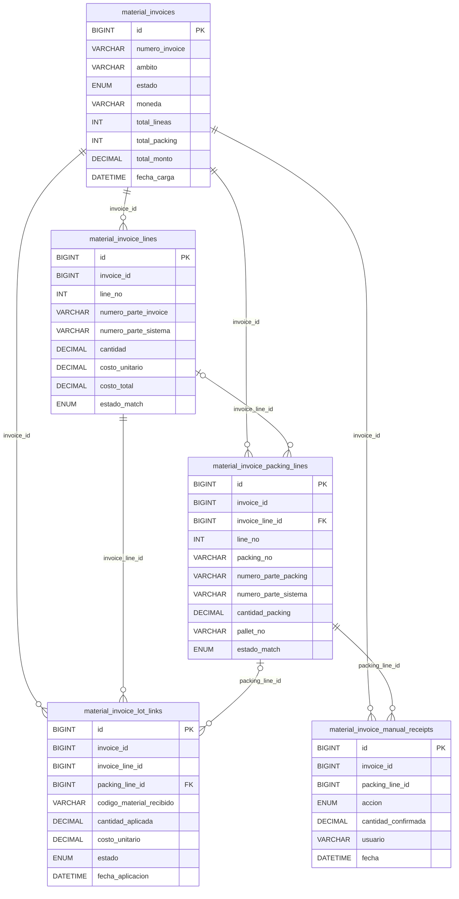

```mermaid
erDiagram
    material_invoices ||--o{ material_invoice_lines : "invoice_id"
    material_invoices ||--o{ material_invoice_packing_lines : "invoice_id"

    material_invoice_lines o|--o{ material_invoice_packing_lines : "invoice_line_id"

    material_invoices ||--o{ material_invoice_lot_links : "invoice_id"
    material_invoice_lines ||--o{ material_invoice_lot_links : "invoice_line_id"
    material_invoice_packing_lines o|--o{ material_invoice_lot_links : "packing_line_id"

    material_invoices ||--o{ material_invoice_manual_receipts : "invoice_id"
    material_invoice_packing_lines ||--o{ material_invoice_manual_receipts : "packing_line_id"

    material_invoices {
        BIGINT id PK
        VARCHAR numero_invoice
        VARCHAR ambito
        ENUM estado
        VARCHAR moneda
        INT total_lineas
        INT total_packing
        DECIMAL total_monto
        DATETIME fecha_carga
    }

    material_invoice_lines {
        BIGINT id PK
        BIGINT invoice_id
        INT line_no
        VARCHAR numero_parte_invoice
        VARCHAR numero_parte_sistema
        DECIMAL cantidad
        DECIMAL costo_unitario
        DECIMAL costo_total
        ENUM estado_match
    }

    material_invoice_packing_lines {
        BIGINT id PK
        BIGINT invoice_id
        BIGINT invoice_line_id FK
        INT line_no
        VARCHAR packing_no
        VARCHAR numero_parte_packing
        VARCHAR numero_parte_sistema
        DECIMAL cantidad_packing
        VARCHAR pallet_no
        ENUM estado_match
    }

    material_invoice_lot_links {
        BIGINT id PK
        BIGINT invoice_id
        BIGINT invoice_line_id
        BIGINT packing_line_id FK
        VARCHAR codigo_material_recibido
        DECIMAL cantidad_aplicada
        DECIMAL costo_unitario
        ENUM estado
        DATETIME fecha_aplicacion
    }

    material_invoice_manual_receipts {
        BIGINT id PK
        BIGINT invoice_id
        BIGINT packing_line_id
        ENUM accion
        DECIMAL cantidad_confirmada
        VARCHAR usuario
        DATETIME fecha
    }
```