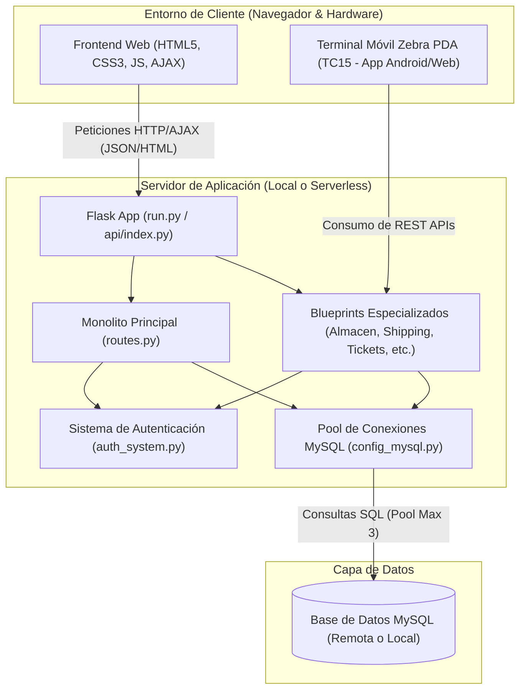
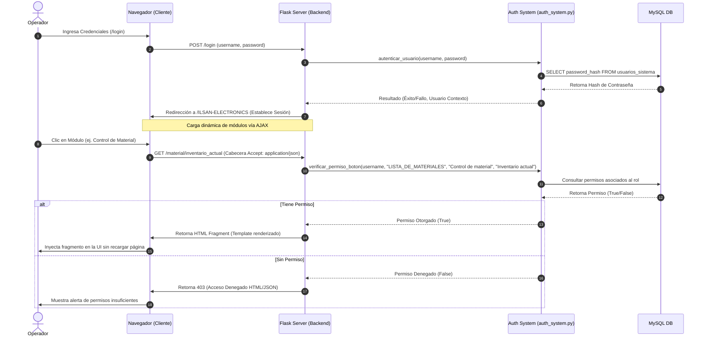
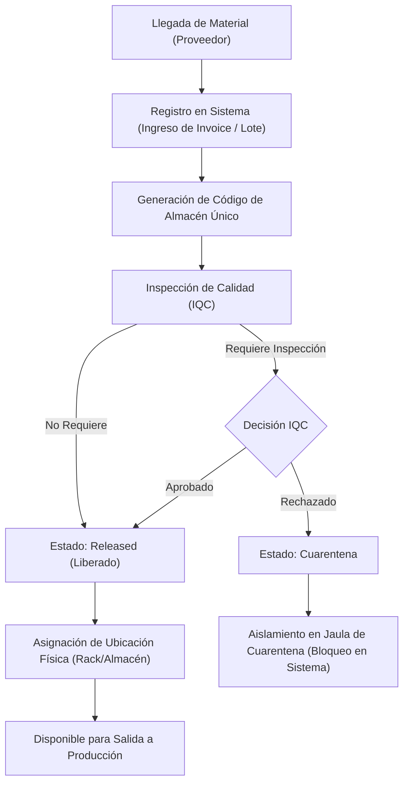
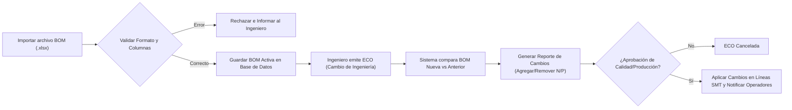
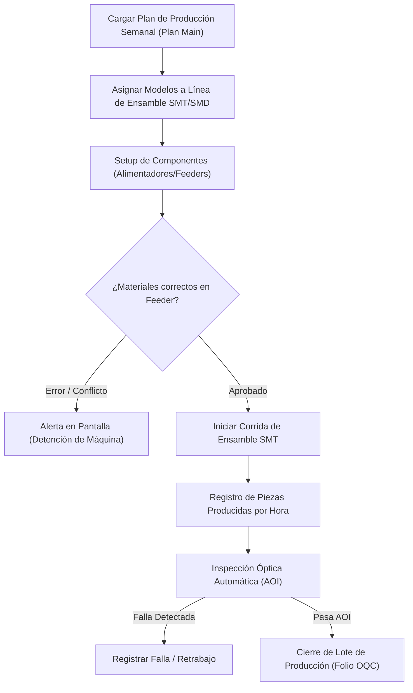
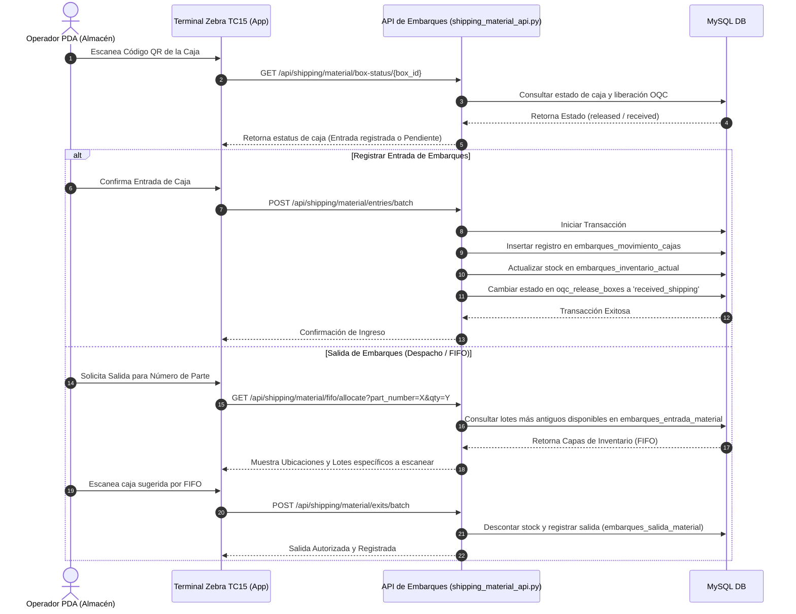

# Manual Técnico Completo - ILSAN MES

Este manual sirve como la **fuente única de verdad** técnica y operativa para el sistema **ILSAN MES (Manufacturing Execution System)**. En este documento se detalla la arquitectura general, los flujos visuales de datos, la estructura del código fuente, el esquema de la base de datos, la integración de hardware de impresión y las guías de despliegue.

---

## 1. Introducción y Propósito del Sistema

El sistema **ILSAN MES** es una plataforma monolítica web integrada con servicios locales diseñada para optimizar los procesos de manufactura de componentes electrónicos (principalmente líneas de montaje superficial SMT y dispositivos SMD). Sus objetivos principales son:
*   **Trazabilidad total de materiales**: Desde la entrada en almacén, etiquetado de rollos/botes, inspección IQC, almacenamiento físico, hasta la salida hacia las líneas de producción.
*   **Gestión de Ingeniería (BOM y ECO)**: Control de listas de materiales (Bill of Materials) e Ingeniería de Cambios (Engineering Change Orders) para asegurar la consistencia del ensamble.
*   **Planeación y Control de Producción**: Asignación de órdenes de trabajo (WO) a líneas físicas, tracking de piezas producidas y control del historial del proceso.
*   **Logística de Embarques (Shipping)**: Control de inventario terminado, despacho en base a primeras entradas - primeras salidas (FIFO), validación OQC (Outgoing Quality Control), e integración con terminales de mano PDA (Zebra TC15).
*   **Soporte Operativo (Tickets Portal)**: Mesa de ayuda interna para incidentes técnicos en planta.

---

## 2. Arquitectura General del Sistema

El sistema utiliza una arquitectura híbrida adaptada tanto para su ejecución local en servidor de planta como para despliegues serverless.



### Componentes Clave:
1.  **Frontend Dinámico (Single Page Feel)**: El frontend se compone de vistas que se inyectan dinámicamente en el shell principal (`/ILSAN-ELECTRONICS`) mediante peticiones AJAX. Esto evita recargas completas de página y proporciona una experiencia fluida.
2.  **Capa WSGI / Flask**: Actúa como el ruteador de la aplicación. En local inicia a través de [run.py](file:///C:/Users/yahir/OneDrive/Escritorio/MES/MES/MESILSANLOCAL/run.py) y en Vercel a través de [api/index.py](file:///C:/Users/yahir/OneDrive/Escritorio/MES/MES/MESILSANLOCAL/api/index.py).
3.  **Mecanismo de Conectividad MySQL**: El acceso se gestiona a través de [config_mysql.py](file:///C:/Users/yahir/OneDrive/Escritorio/MES/MES/MESILSANLOCAL/app/config_mysql.py), que implementa un pool dinámico de conexiones con soporte para reintentos y timeouts.

---

## 3. Flujos Visuales de Procesos Clave

### A. Autenticación y Carga Dinámica de Módulos (AJAX)
Este flujo ilustra cómo el sistema valida credenciales y carga de manera dinámica los módulos del backend en el shell del cliente según sus permisos específicos.



---

### B. Ciclo de Recepción y Control de Materiales en Almacén
Este flujo describe la logística interna para el ingreso de materias primas al almacén, su validación de calidad y almacenamiento.



---

### C. Ciclo de Vida de BOM y ECO (Engineering Change Orders)
El control de cambios de ingeniería garantiza que las modificaciones en las configuraciones de ensamble sean validadas y rastreadas históricamente.



---

### D. Flujo de Control de Planeación y Producción (Lines SMT/SMD)
El proceso que enlaza las órdenes de planeación general con la ejecución física de las máquinas SMT y el conteo de producción.



---

### E. Integración de la API de Embarques y Terminales PDA Zebra
Este flujo ilustra cómo interactúa el personal de almacén usando las terminales PDA Zebra TC15 con la API REST de embarques bajo el principio FIFO (First In, First Out).



---

## 4. Estructura Detallada del Repositorio

El proyecto mantiene una estructura modular. A continuación se detallan las carpetas y archivos fundamentales:

*   [run.py](file:///C:/Users/yahir/OneDrive/Escritorio/MES/MES/MESILSANLOCAL/run.py): Punto de entrada principal en ejecución local. Carga la app Flask e inicia el servidor de desarrollo.
*   [vercel.json](file:///C:/Users/yahir/OneDrive/Escritorio/MES/MES/MESILSANLOCAL/vercel.json): Configuración de Vercel para enrutamiento serverless. Redirige todas las rutas HTTP a `api/index.py`.
*   [api/index.py](file:///C:/Users/yahir/OneDrive/Escritorio/MES/MES/MESILSANLOCAL/api/index.py): Punto de entrada y configuración del blueprint central para ejecuciones serverless.
*   [requirements.txt](file:///C:/Users/yahir/OneDrive/Escritorio/MES/MES/MESILSANLOCAL/requirements.txt): Declaración de las dependencias requeridas (Flask, pymysql, openpyxl, pandas, etc.).
*   [app/](file:///C:/Users/yahir/OneDrive/Escritorio/MES/MES/MESILSANLOCAL/app): Directorio raíz del código de la aplicación Flask.
    *   [app/routes.py](file:///C:/Users/yahir/OneDrive/Escritorio/MES/MES/MESILSANLOCAL/app/routes.py): El monolito del backend. Contiene la mayoría de las rutas heredadas, controladores HTML y los decoradores principales de sesión (`@login_requerido`).
    *   [app/auth_system.py](file:///C:/Users/yahir/OneDrive/Escritorio/MES/MES/MESILSANLOCAL/app/auth_system.py): Sistema de autenticación de usuarios. Administra logins, encriptación, validación de permisos de botones específicos y el log de auditoría.
    *   [app/db_mysql.py](file:///C:/Users/yahir/OneDrive/Escritorio/MES/MES/MESILSANLOCAL/app/db_mysql.py): Core de ejecución de consultas SQL. Contiene utilidades de compatibilidad de sintaxis entre dialectos de bases de datos.
    *   [app/config_mysql.py](file:///C:/Users/yahir/OneDrive/Escritorio/MES/MES/MESILSANLOCAL/app/config_mysql.py): Inicializador del pool de conexiones. Configura límites de hilos, timeouts de lectura/escritura y reconexión automática.
    *   [app/Almacen_api.py](file:///C:/Users/yahir/OneDrive/Escritorio/MES/MES/MESILSANLOCAL/app/Almacen_api.py): API de administración de inventarios de almacén. Controla listados, historial de entradas/salidas/retornos y exportación de reportes Excel estructurados.
    *   [app/shipping_api.py](file:///C:/Users/yahir/OneDrive/Escritorio/MES/MES/MESILSANLOCAL/app/shipping_api.py): Capa de autenticación de embarques, permisos, catálogos de cargos/departamentos y endpoints para terminales móviles PDA.
    *   [app/shipping_material_api.py](file:///C:/Users/yahir/OneDrive/Escritorio/MES/MES/MESILSANLOCAL/app/shipping_material_api.py): Controlador maestro de movimientos físicos de almacén de embarques. Maneja lógica FIFO, cierres de inventario y caja por caja.
    *   [app/tickets_portal.py](file:///C:/Users/yahir/OneDrive/Escritorio/MES/MES/MESILSANLOCAL/app/tickets_portal.py): Portal de soporte IT interno. Administra tickets de prioridad baja a crítica con soporte para adjuntar imágenes.
    *   [app/py/Backend metal mask.py](file:///C:/Users/yahir/OneDrive/Escritorio/MES/MES/MESILSANLOCAL/app/py/Backend%20metal%20mask.py): Módulo para tracking de ubicaciones y ciclos de uso de las plantillas metálicas (stencil) de soldadura.
    *   [app/templates/](file:///C:/Users/yahir/OneDrive/Escritorio/MES/MES/MESILSANLOCAL/app/templates): Contenedor de todas las vistas HTML de Jinja2, divididas por departamentos.
    *   [app/static/](file:///C:/Users/yahir/OneDrive/Escritorio/MES/MES/MESILSANLOCAL/app/static): Recursos estáticos del frontend (imágenes, hojas de estilo CSS y scripts JS de soporte).

---

## 5. Módulos Funcionales y Catálogo de APIs

A continuación se detalla el comportamiento lógico y de seguridad de los principales endpoints expuestos por el sistema.

### 5.1 Sistema de Autenticación y Auditoría (`app/auth_system.py`)
Maneja la seguridad del sistema y el control de accesos basados en roles (RBAC - Role Based Access Control).
*   **Permiso de Botón**: Define que cada botón interactivo de la interfaz web está ligado a una página, una sección y un identificador de botón en la tabla `permisos_botones`. El decorador `@requiere_permiso` valida si el usuario cuenta con dicho permiso antes de resolver la ruta.
*   **Auditoría de Acciones**: Las mutaciones críticas de base de datos invocan la función `registrar_auditoria()`, la cual escribe de forma inmediata en la tabla `auditoria_sistema` el usuario, módulo, acción realizada, descripción detallada y resultado de la transacción.

### 5.2 Módulo de Almacén y Control de Materiales (`app/Almacen_api.py`)
Proporciona endpoints y vistas para el control de materia prima recibida.
*   `GET /material/inventario_actual`: Renderiza la vista de inventario basada en AJAX. Requiere el permiso `LISTA_DE_MATERIALES > Control de material > Inventario actual`.
*   `GET /api/material_admin/inventory/summary`: Devuelve el resumen agrupado por número de parte, cantidad en stock y lotes.
*   `GET /api/material_admin/inventory/lots`: Devuelve el inventario desglosado por lote individual, mostrando cuarentena y fechas de recibo.
*   `GET /api/material_admin/inventory/export`: Genera y retorna un documento Excel estructurado con estilos visuales unificados.

### 5.3 Módulo de Embarques e Integración PDA (`app/shipping_api.py` & `app/shipping_material_api.py`)
Módulo crítico que gestiona el inventario de producto terminado.
*   `POST /api/shipping/auth/login`: Autentica al personal de almacén en la PDA móvil. Cuenta con lógica de intentos fallidos (Max 5) y bloqueo temporal del usuario (15 minutos).
*   `GET /api/shipping/users/<user_id>/permissions`: Devuelve la lista de permisos efectivos del usuario móvil, soportando compatibilidad retroactiva.
*   `POST /api/shipping/material/entries/batch`: Registra una entrada masiva de cajas previamente liberadas en inspección OQC al inventario de embarques.
*   `GET /api/shipping/material/fifo/allocate`: Motor FIFO del sistema. Recibe un número de parte y la cantidad requerida, y devuelve el orden exacto en el que las cajas deben ser despachadas basándose en su fecha de registro en almacén.
*   `POST /api/shipping/material/exits/batch`: Registra la salida física de cajas hacia transporte o cliente final, reduciendo el stock disponible en sistema.

### 5.4 Portal de Soporte IT (`app/tickets_portal.py`)
Canal de soporte de software y hardware interno de planta.
*   `GET /portal-tickets`: Renderiza el dashboard principal del sistema de tickets.
*   `POST /api/tickets`: Crea un nuevo ticket. Soporta dos variantes: `normal` (comunicación directa operador-superadmin) y `superticket` (donde solo superadmin puede responder, para comunicados oficiales).
*   `POST /api/tickets/<ticket_id>/reply`: Registra una respuesta en el ticket y admite la subida de hasta 5 imágenes como evidencia en formato JPG/PNG.

---

## 6. Esquema de Base de Datos MySQL

El sistema utiliza MySQL como motor de persistencia relacional. A continuación se describen las tablas fundamentales y sus propósitos operativos:

| Nombre de la Tabla | Propósito Operativo | Relaciones Clave |
| :--- | :--- | :--- |
| `usuarios_sistema` | Registro de usuarios, correos, departamento, cargo y estatus activo. Contiene hashes SHA-256. | Primaria: `id`. |
| `roles` / `usuario_roles` | Gestión de roles de usuario (superadmin, admin, planeador, operador, etc.). | Relaciona `usuarios_sistema` con `roles`. |
| `permisos_botones` | Catálogo de permisos del sistema parametrizado por página, sección y botón. | Primaria: `id`. |
| `rol_permisos_botones` | Tabla de mapeo que otorga permisos específicos a roles definidos. | Clave foránea a `roles` y `permisos_botones`. |
| `control_material_almacen` | Registro histórico de entradas de materia prima en almacén general. | Primaria: `id`. Clave: `codigo_material_recibido`. |
| `control_material_salida` | Registro de egreso de materiales hacia las líneas de producción. | Referencia a `control_material_almacen` (`codigo_material_recibido`). |
| `inventario_lotes` | Tabla agregada que mantiene el stock actual de materia prima por lote/ubicación. | Relacionado con `control_material_almacen`. |
| `embarques_catalogo_partes` | Catálogo maestro de números de parte de producto terminado asignados a embarques. | Primaria: `id`. Clave única: `part_number`. |
| `embarques_inventario_actual` | Inventario consolidado en tiempo real de cajas en almacén de embarques. | Foránea a `embarques_catalogo_partes` (`catalog_id`). |
| `embarques_movimiento_cajas` | Historial físico de entradas, salidas y ubicaciones de cajas individuales OQC en embarques. | Mantiene tracking por `box_code`. |
| `oqc_release_boxes` | Tabla puente de cajas inspeccionadas y liberadas por el departamento de Calidad (OQC). | Primaria: `id`. |
| `support_tickets` | Cabeceras de los tickets levantados en el portal de soporte. | Primaria: `id`. |
| `support_ticket_messages` | Mensajes asociados a cada ticket del portal (conversación). | Foránea a `support_tickets` (`ticket_id`). |
| `support_ticket_attachments` | Archivos adjuntos y fotos de evidencia cargados en los tickets. | Foránea a `support_ticket_messages` (`message_id`). |
| `auditoria_sistema` | Log de auditoría global del MES para tracking de acciones críticas de seguridad. | Guarda `usuario` e información del cambio. |

> [!TIP]
> **Inicialización Automática**: Módulos como `tickets_portal.py` y `shipping_material_api.py` ejecutan scripts DDL condicionales (`CREATE TABLE IF NOT EXISTS`) en su arranque. Esto asegura que la base de datos se configure de manera automática con las columnas necesarias en su primera ejecución.

---


## 8. Guía de Configuración, Despliegue y Operación

### 8.1 Requisitos Base del Entorno
*   **Python 3.11.x** (Especificado en [runtime.txt](file:///C:/Users/yahir/OneDrive/Escritorio/MES/MES/MESILSANLOCAL/runtime.txt)).
*   **MySQL Server 8.0** o superior.

### 8.2 Variables de Entorno Requeridas (.env)
Debe crearse un archivo `.env` en la raíz del proyecto basándose en [.env.example](file:///C:/Users/yahir/OneDrive/Escritorio/MES/MES/MESILSANLOCAL/.env.example):

```bash
# Configuración de Base de Datos
MYSQL_HOST=tu_servidor_mysql
MYSQL_PORT=3306
MYSQL_DATABASE=mes_db
MYSQL_USER=tu_usuario
MYSQL_PASSWORD=tu_contraseña

# Configuración de Seguridad Flask
SECRET_KEY=clave_secreta_para_sesiones_flask

# Configuración del Entorno de Ejecución
TZ=America/Mexico_City
```

### 8.3 Ejecución en Modo Desarrollo (Local)
Para levantar el servidor web local con recarga automática:

```powershell
# 1. Crear y activar entorno virtual (Recomendado)
python -m venv .venv
.venv\Scripts\activate

# 2. Instalar dependencias
pip install -r requirements.txt

# 3. Correr el servidor web principal (Puerto 5000 por defecto)
python run.py
```

### 8.4 Despliegue en Servidor de Producción / Serverless (Vercel)
Este proyecto está preparado para ejecutarse en entornos serverless como Vercel:
1.  El archivo [vercel.json](file:///C:/Users/yahir/OneDrive/Escritorio/MES/MES/MESILSANLOCAL/vercel.json) redirige las peticiones al ruteador serverless [api/index.py](file:///C:/Users/yahir/OneDrive/Escritorio/MES/MES/MESILSANLOCAL/api/index.py).
2.  Las variables de entorno `MYSQL_*` deben configurarse en el panel de control del proyecto de Vercel.
3.  El pool de conexiones en serverless debe mantenerse pequeño (`_MAX_POOL_SIZE = 3` en `config_mysql.py`) para evitar la saturación de conexiones en el servidor MySQL debido a la naturaleza efímera y escalable de las funciones serverless de Vercel.

---

## 9. Hallazgos Técnicos, Seguridad y Roadmap de Refactorización

Como parte del análisis de ingeniería realizado sobre el código fuente actual, se han detectado áreas de atención crítica:

### 9.1 Riesgos Críticos de Seguridad
*   **Rutas de Escritura sin Autenticación**: En el monolito [routes.py](file:///C:/Users/yahir/OneDrive/Escritorio/MES/MES/MESILSANLOCAL/app/routes.py) existen endpoints de inserción y modificación de datos que no cuentan con los decoradores `@login_requerido` ni `@requiere_permiso`. Esto expone el sistema a posibles modificaciones de datos no autorizadas si se accede directamente a las APIs.
*   **Inconsistencia en Claves de Sesión**: Se observa el uso alternado de `session['usuario']` y `session['username']` en diferentes archivos. Esto puede provocar fallos de permisos o expulsión involuntaria de la sesión activa del usuario.

### 9.2 Programa de Refactorización Activo
El sistema se encuentra en un proceso de transición para desacoplar el monolito [routes.py](file:///C:/Users/yahir/OneDrive/Escritorio/MES/MES/MESILSANLOCAL/app/routes.py) (que actualmente supera el millón de caracteres) en Blueprints Flask especializados e independientes.
*   **Fase 1 (Completada)**: Migración de los submódulos de Almacén a [Almacen_api.py](file:///C:/Users/yahir/OneDrive/Escritorio/MES/MES/MESILSANLOCAL/app/Almacen_api.py).
*   **Fase 2 (Completada)**: Migración y diseño de la API de Embarques en [shipping_api.py](file:///C:/Users/yahir/OneDrive/Escritorio/MES/MES/MESILSANLOCAL/app/shipping_api.py) y [shipping_material_api.py](file:///C:/Users/yahir/OneDrive/Escritorio/MES/MES/MESILSANLOCAL/app/shipping_material_api.py).
*   **Fase 3 (En Progreso)**: Extracción de las rutas SMT/SMD y migración a planos dedicados.
*   **Fase 4 (Planificada)**: Unificación y auditoría completa de seguridad, forzando decoradores de autenticación en cada endpoint del backend.
