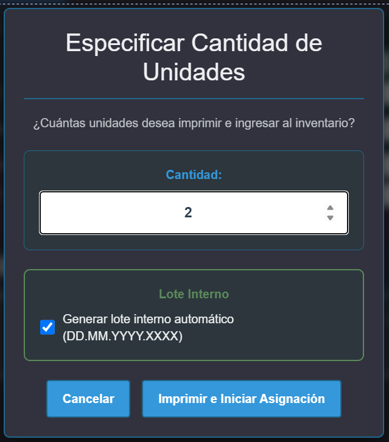

# PROBLEMA: Lote Interno Duplicado - No Incrementa Secuencial

## Fecha del Problema
**04 de Noviembre de 2025**

---

## Descripción del Problema

Al generar lotes internos para múltiples etiquetas, el sistema genera el **mismo número secuencial** para todas las etiquetas en lugar de generar números consecutivos únicos.

### Comportamiento Actual (INCORRECTO)
```
Etiqueta 1: 04.11.2025.0003
Etiqueta 2: 04.11.2025.0003  ❌ DUPLICADO
Etiqueta 3: 04.11.2025.0003  ❌ DUPLICADO
```

### Comportamiento Esperado (CORRECTO)
```
Etiqueta 1: 04.11.2025.0003  ✅
Etiqueta 2: 04.11.2025.0004  ✅
Etiqueta 3: 04.11.2025.0005  ✅
```

---

## Análisis Técnico

### 1. Flujo de Generación de Lote Interno

**Ubicación del Código:** 
- Frontend: `Control de material de almacen.html`
- Backend: `app/routes.py` → endpoint `/obtener_secuencial_lote_interno`

**Función JavaScript de Generación:**
```javascript
async function generarLoteInterno() {
    try {
        const today = new Date();
        const dia = String(today.getDate()).padStart(2, '0');
        const mes = String(today.getMonth() + 1).padStart(2, '0');
        const anio = today.getFullYear();
        const fechaFormato = `${dia}.${mes}.${anio}`;
        
        // Llamar al servidor para obtener el siguiente secuencial del día
        const response = await fetch('/obtener_secuencial_lote_interno', {
            method: 'POST',
            headers: {
                'Content-Type': 'application/json'
            },
            body: JSON.stringify({
                fecha: fechaFormato
            })
        });
        
        if (!response.ok) {
            throw new Error('Error al obtener secuencial del día');
        }
        
        const data = await response.json();
        const secuencial = String(data.siguiente_secuencial).padStart(4, '0');
        window.loteInternoGenerado = `${fechaFormato}.${secuencial}`;
        
        return window.loteInternoGenerado;
    } catch (error) {
        console.error('Error generando lote interno:', error);
        throw error;
    }
}
```

**Endpoint Backend:**
```python
@app.route('/obtener_secuencial_lote_interno', methods=['POST'])
@login_requerido
def obtener_secuencial_lote_interno():
    try:
        data = request.get_json()
        fecha = data.get('fecha', '')  # Formato: DD.MM.YYYY
        
        if not fecha:
            return jsonify({'siguiente_secuencial': 1}), 200
        
        conn = get_db_connection()
        cursor = conn.cursor()
        
        try:
            query = '''
                SELECT numero_lote_material,
                       CAST(SUBSTRING_INDEX(numero_lote_material, '.', -1) AS UNSIGNED) as seq
                FROM control_material_almacen
                WHERE numero_lote_material LIKE %s
                ORDER BY seq DESC
                LIMIT 1
            '''
            cursor.execute(query, (f'{fecha}.%',))
            
            result = cursor.fetchone()
            
            print(f"DEBUG: Consultando secuencial para fecha: {fecha}")
            print(f"DEBUG: Resultado de query: {result}")
            
            if result:
                if isinstance(result, dict):
                    max_seq = result.get('seq', 0) or 0
                else:
                    max_seq = result[1] if len(result) > 1 and result[1] else 0
            else:
                max_seq = 0
            
            siguiente_secuencial = max_seq + 1
            
            print(f"DEBUG: max_seq encontrado: {max_seq}, siguiente: {siguiente_secuencial}")
            
            conn.close()
            return jsonify({'siguiente_secuencial': siguiente_secuencial}), 200
            
        except Exception as e:
            print(f"Error consultando secuencial: {e}")
            conn.close()
            return jsonify({'siguiente_secuencial': 1}), 200
            
    except Exception as e:
        print(f"Error en obtener_secuencial_lote_interno: {str(e)}")
        return jsonify({'error': str(e), 'siguiente_secuencial': 1}), 500
```

---

## 2. Logs del Servidor

### Logs Observados (Problema Identificado)
```
DEBUG: Consultando secuencial para fecha: 04.11.2025
DEBUG: Resultado de query: {'numero_lote_material': '04.11.2025.0002', 'seq': 2}
DEBUG: max_seq encontrado: 2, siguiente: 3
127.0.0.1 - - [04/Nov/2025 18:54:18] "POST /obtener_secuencial_lote_interno HTTP/1.1" 200 -
```

**Observación Crítica:** 
- El endpoint SÍ está devolviendo el siguiente secuencial correcto (3)
- Pero este log aparece **UNA SOLA VEZ** para todas las etiquetas
- Esto significa que la función `generarLoteInterno()` se está llamando solo una vez

---

## 3. Punto de Llamada de generarLoteInterno()

### Ubicación Actual del Código

**En `procesarEscaneoEtiquetaImpresa()` (línea ~6059):**
```javascript
async function procesarEscaneoEtiquetaImpresa(event) {
    // ... código de validación ...
    
    // Asignar lote automáticamente
    asignacionesLotes[indiceEtiqueta].loteProveedor = loteProveedor;
    asignacionesLotes[indiceEtiqueta].asignado = true;
    
    // Si se usa lote interno, generar uno único para esta etiqueta AHORA
    if (usandoLoteInterno && typeof window.generarLoteInterno === 'function') {
        asignacionesLotes[indiceEtiqueta].loteInterno = await window.generarLoteInterno();
    }
    
    // Actualizar tabla inmediatamente
    actualizarTablaAsignaciones();
    
    // ... resto del código ...
}
```

---

## 4. Causa Raíz del Problema

### PROBLEMA IDENTIFICADO: Race Condition + Cache

**El problema es una combinación de factores:**

1. **Consulta a Base de Datos No Refleja Cambios Inmediatos:**
   - Cuando se escanea la primera etiqueta → genera lote `.0003`
   - El lote NO se guarda en la BD hasta que se hace clic en "Finalizar Asignación"
   - Cuando se escanea la segunda etiqueta → consulta la BD
   - La BD todavía NO tiene el `.0003` guardado
   - Devuelve el mismo secuencial: `.0003`

2. **Separación Temporal Entre Generación y Guardado:**
   ```
   [Escaneo Etiqueta 1] → Genera 0003 (memoria) → No guarda aún
   [Escaneo Etiqueta 2] → Consulta BD (solo ve hasta 0002) → Genera 0003 ❌
   [Escaneo Etiqueta 3] → Consulta BD (solo ve hasta 0002) → Genera 0003 ❌
   ...
   [Finalizar Asignación] → Guarda todos los 0003 a la BD
   ```

3. **Consulta SQL Solo Ve Registros Guardados:**
   ```sql
   SELECT numero_lote_material,
          CAST(SUBSTRING_INDEX(numero_lote_material, '.', -1) AS UNSIGNED) as seq
   FROM control_material_almacen
   WHERE numero_lote_material LIKE '04.11.2025.%'
   ORDER BY seq DESC
   LIMIT 1
   ```
   - Esta consulta solo ve registros que YA ESTÁN en la tabla
   - Los lotes generados en memoria NO se reflejan hasta el guardado final

---

## 5. Soluciones Propuestas

### ❌ Solución 1: Guardar Inmediatamente Después de Generar (RECHAZADA)
**Problema:** Requiere guardar cada etiqueta individualmente, muy lento y complejo.

---

### ❌ Solución 2: Contador en Memoria con Sincronización (RECHAZADA)
**Problema:** No garantiza unicidad en entornos multi-usuario.

---

### ✅ Solución 3: Generación de Todos los Lotes al Inicio (RECOMENDADA)

**Descripción:**
- Cuando el usuario marca "Lote Interno" y especifica cantidad (ej: 5 etiquetas)
- Generar TODOS los lotes consecutivos inmediatamente
- Asignar cada lote pre-generado a su etiqueta correspondiente
- Al escanear, solo asociar el lote ya generado

**Implementación:**

```javascript
async function procesarImpresionUnidades() {
    const cantidad = parseInt(document.getElementById('cantidad-unidades').value);
    
    if (!cantidad || cantidad < 1 || cantidad > 999) {
        alert('Por favor ingrese una cantidad válida (1-999)');
        return;
    }
    
    try {
        const checkboxLoteInterno = document.getElementById('asignar-lote-interno');
        const usarLoteInterno = checkboxLoteInterno ? checkboxLoteInterno.checked : false;
        
        // Array para almacenar todos los lotes generados
        let lotesGenerados = [];
        
        // Si se usa lote interno, generar TODOS los lotes al inicio
        if (usarLoteInterno) {
            mostrarIndicadorProceso('Generando lotes internos consecutivos...');
            
            for (let i = 0; i < cantidad; i++) {
                const loteGenerado = await window.generarLoteInterno();
                lotesGenerados.push(loteGenerado);
                
                // Esperar un poco entre cada generación para asegurar incremento
                await new Promise(resolve => setTimeout(resolve, 200));
            }
            
            ocultarIndicadorProceso();
        }
        
        cerrarModalUnidades();
        
        etiquetasImpresas = [];
        const codigoBase = document.getElementById('numero_parte_lower')?.value || materialExistente.codigo;
        
        // Crear etiquetas con lotes pre-asignados
        for (let i = 1; i <= cantidad; i++) {
            const codigoConsecutivo = generarCodigoConsecutivo(codigoBase, i);
            etiquetasImpresas.push({
                numero: i,
                codigo: codigoConsecutivo,
                loteProveedor: null,
                loteInterno: lotesGenerados[i - 1] || null, // Asignar lote pre-generado
                asignado: false,
                usandoLoteInterno: usarLoteInterno
            });
        }
        
        if (usarLoteInterno) {
            abrirModalAsignacionLotes();
            imprimirEnSegundoPlano(cantidad);
        } else {
            imprimirYGuardarDirecto(cantidad);
        }
        
    } catch (error) {
        console.error('Error en impresión:', error);
        alert('Error al imprimir etiquetas: ' + error.message);
        ocultarIndicadorProceso();
    }
}
```

**Modificación en procesarEscaneoEtiquetaImpresa:**
```javascript
async function procesarEscaneoEtiquetaImpresa(event) {
    // ... código de validación ...
    
    // Asignar lote automáticamente
    asignacionesLotes[indiceEtiqueta].loteProveedor = loteProveedor;
    asignacionesLotes[indiceEtiqueta].asignado = true;
    
    // El lote interno YA fue asignado al inicio, no generar aquí
    // Solo marcar como asignado
    
    // Actualizar tabla inmediatamente
    actualizarTablaAsignaciones();
    
    // ... resto del código ...
}
```

---

### ✅ Solución 4: Contador Local con Incremento Manual (ALTERNATIVA)

**Descripción:**
- Obtener el secuencial inicial una sola vez
- Incrementar manualmente en memoria para cada etiqueta
- No consultar la BD repetidamente

**Implementación:**

```javascript
async function procesarImpresionUnidades() {
    const cantidad = parseInt(document.getElementById('cantidad-unidades').value);
    
    if (!cantidad || cantidad < 1 || cantidad > 999) {
        alert('Por favor ingrese una cantidad válida (1-999)');
        return;
    }
    
    try {
        const checkboxLoteInterno = document.getElementById('asignar-lote-interno');
        const usarLoteInterno = checkboxLoteInterno ? checkboxLoteInterno.checked : false;
        
        // Si se usa lote interno, obtener el secuencial base
        if (usarLoteInterno) {
            // Obtener el primer lote
            const primerLote = await window.generarLoteInterno();
            
            // Extraer el número secuencial del primer lote (ej: "04.11.2025.0003" → 3)
            const partesLote = primerLote.split('.');
            const fechaBase = partesLote.slice(0, 3).join('.'); // "04.11.2025"
            let secuencialActual = parseInt(partesLote[3]); // 3
            
            // Guardar en variable global para uso posterior
            window.secuencialBaseLote = secuencialActual;
            window.fechaBaseLote = fechaBase;
        }
        
        cerrarModalUnidades();
        
        etiquetasImpresas = [];
        const codigoBase = document.getElementById('numero_parte_lower')?.value || materialExistente.codigo;
        
        for (let i = 1; i <= cantidad; i++) {
            const codigoConsecutivo = generarCodigoConsecutivo(codigoBase, i);
            
            // Calcular el lote con incremento manual
            let loteInterno = null;
            if (usarLoteInterno) {
                const secuencial = String(window.secuencialBaseLote + (i - 1)).padStart(4, '0');
                loteInterno = `${window.fechaBaseLote}.${secuencial}`;
            }
            
            etiquetasImpresas.push({
                numero: i,
                codigo: codigoConsecutivo,
                loteProveedor: null,
                loteInterno: loteInterno,
                asignado: false,
                usandoLoteInterno: usarLoteInterno
            });
        }
        
        if (usarLoteInterno) {
            abrirModalAsignacionLotes();
            imprimirEnSegundoPlano(cantidad);
        } else {
            imprimirYGuardarDirecto(cantidad);
        }
        
    } catch (error) {
        console.error('Error en impresión:', error);
        alert('Error al imprimir etiquetas: ' + error.message);
        ocultarIndicadorProceso();
    }
}
```

---

## 6. Recomendación Final

**Implementar Solución 4: Contador Local con Incremento Manual**

### Ventajas:
✅ Una sola consulta a la base de datos  
✅ Lotes pre-calculados antes de escanear  
✅ Visible en la tabla desde el inicio  
✅ No hay race conditions  
✅ Rápido y eficiente  
✅ Garantiza unicidad dentro de la misma sesión  

### Desventajas:
⚠️ Requiere lógica adicional para manejar errores de guardado  
⚠️ Si el usuario cancela a mitad, puede haber "huecos" en la secuencia  

---

## 7. Plan de Implementación

1. **Modificar `procesarImpresionUnidades()`**
   - Obtener primer secuencial
   - Pre-calcular todos los lotes consecutivos
   - Asignar a cada etiqueta antes de abrir modal

2. **Modificar `procesarEscaneoEtiquetaImpresa()`**
   - Eliminar generación de lote interno (ya está asignado)
   - Solo marcar como asignado al escanear

3. **Actualizar `actualizarTablaAsignaciones()`**
   - Mostrar `loteInterno` si está disponible
   - Priorizar `loteInterno` sobre `loteProveedor`

4. **Testing:**
   - Probar con 1 etiqueta
   - Probar con 10 etiquetas
   - Verificar secuencia consecutiva correcta
   - Verificar guardado en base de datos

---

## 8. Archivos Afectados

```
📁 MESILSANLOCAL/
├── app/
│   ├── routes.py (Backend - Sin cambios necesarios)
│   └── templates/
│       └── Control de material/
│           └── Control de material de almacen.html (Frontend - MODIFICAR)
└── Documentacion/
    └── PROBLEMA_LOTE_INTERNO_DUPLICADO.md (Este documento)
```

---

## Estado Actual
**� IMPLEMENTADO - Solución 4**

**Fecha de Implementación:** 04 de Noviembre de 2025, 18:56

### Cambios Realizados:

1. **Modificado `procesarImpresionUnidades()` (línea ~5490)**
   - Genera el primer lote interno para obtener el secuencial base
   - Pre-calcula todos los lotes consecutivos usando incremento manual
   - Asigna cada lote a su etiqueta correspondiente antes de abrir el modal

2. **Modificado `procesarEscaneoEtiquetaImpresa()` (línea ~6057)**
   - Eliminada la generación de lote interno al escanear
   - El lote ya está pre-asignado, solo se marca como asignado

3. **`actualizarTablaAsignaciones()` - Sin cambios**
   - Ya muestra correctamente `loteInterno` prioritario sobre `loteProveedor`

### Resultado Esperado:
```
Usuario selecciona 3 etiquetas con lote interno
→ Sistema genera: 04.11.2025.0003, 0004, 0005 (pre-calculados)
→ Al escanear etiqueta 1: muestra 04.11.2025.0003
→ Al escanear etiqueta 2: muestra 04.11.2025.0004
→ Al escanear etiqueta 3: muestra 04.11.2025.0005
→ Al guardar: cada etiqueta mantiene su lote único
```

### Testing Pendiente:
- [ ] Probar con 1 etiqueta
- [ ] Probar con 5 etiquetas
- [ ] Probar con 10 etiquetas
- [ ] Verificar en base de datos que los lotes sean consecutivos
- [ ] Verificar que no haya duplicados

---

Fecha de Documentación: 04 de Noviembre de 2025, 18:54  
Fecha de Implementación: 04 de Noviembre de 2025, 18:56
