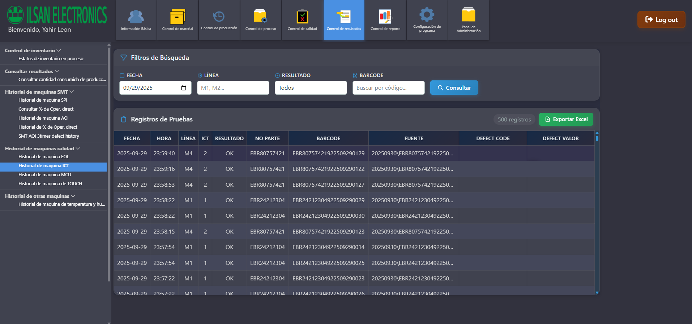
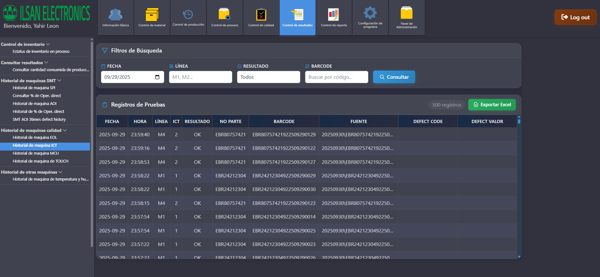

# PROMPT: Implementación Control BOM AJAX - Estado y Resolución

## CONTEXTO ACTUAL (Septiembre 2025)

### PROBLEMA IDENTIFICADO
El usuario reportó: **"Checa que control bom se importe correctamente con ajax ya que no se oculta el contenedor cuando cargo uno nuevo y no oculta los otros contenedores cuando lo cargo"**

### DIAGNÓSTICO TÉCNICO
- **Control BOM** tiene doble implementación: estática (`CONTROL_DE_BOM.html`) y AJAX (`control_bom_ajax.html`)
- El módulo AJAX **NO** estaba ocultando correctamente los contenedores previos al cargarse
- La ruta `/control-bom-ajax` existe pero el template necesitaba reconstrucción completa
- La función `mostrarControlBOM()` en `scriptMain.js` tenía la lógica de ocultación correcta pero el template era incompleto

## ESTADO DE LA IMPLEMENTACIÓN

### ✅ COMPLETADO
1. **Ruta AJAX funcional**: `/control-bom-ajax` en `app/routes.py` líneas 3135-3150
2. **Contenedor en MaterialTemplate**: `bom-unique-container` existe
3. **Función de visibilidad mejorada**: `mostrarControlBOM()` con lógica completa de ocultación
4. **Template reconstruido**: `app/templates/Control de proceso/control_bom_ajax.html` con patrón AJAX completo

### 🔄 EN PROGRESO  
- Template `control_bom_ajax.html` reconstruido siguiendo el patrón establecido por `control_modelos_smt_ajax.html`
- Servidor Flask funcionando en puerto 5000
- Implementación con sufijo único `-bom` y auto-inicialización

## ESTRUCTURA TÉCNICA IMPLEMENTADA

### Archivos Modificados/Creados:
```
app/templates/Control de proceso/control_bom_ajax.html  [RECONSTRUIDO COMPLETO]
app/static/js/scriptMain.js  [YA ACTUALIZADO CON LÓGICA]
app/routes.py  [RUTA YA EXISTE]
app/templates/MaterialTemplate.html  [CONTENEDOR YA EXISTE]
```

### Patrón AJAX Implementado:
```html
<!-- SUFIJO ÚNICO: -bom -->
<!-- CONTENEDOR: bom-unique-container -->
<div id="bom-main-container-unique-bom" class="bom-container">
    <!-- Funcionalidad completa BOM con IDs únicos -->
</div>
```

### JavaScript Auto-inicialización:
```javascript
(function() {
    window.inicializarControlBOMAjax = function() {
        console.log('Control BOM AJAX inicializado');
        cargarModelosDropdown();
    };
    // Auto-ejecución cuando DOM esté listo
})();
```

## FUNCIONALIDADES IMPLEMENTADAS EN EL TEMPLATE

### 🔧 Características Técnicas:
- **Botonera completa**: Consultar, Registrar, Eliminar, Sustituir, Exportar/Importar Excel
- **Dropdown de modelos**: Con filtrado dinámico y carga desde servidor
- **Tabla BOM**: 15 columnas con datos completos (Código material, Número parte, Side, etc.)
- **Modales personalizados**: Alertas y carga con progreso
- **Estilos encapsulados**: CSS completamente aislado con prefijo `.bom-`
- **Responsive design**: Adaptativo para móviles

### 🎯 Endpoints Esperados (Para implementar en routes.py):
```python
/listar_modelos_bom     # GET - Lista modelos disponibles
/consultar_bom          # POST - Consulta BOM por modelo  
/importar_excel_bom     # POST - Importa archivo Excel
```

## LÓGICA DE VISIBILIDAD IMPLEMENTADA

### En `scriptMain.js` función `mostrarControlBOM()`:
```javascript
// 1. Ocultar TODAS las secciones principales
if (informacionBasicaEl) informacionBasicaEl.style.display = 'none';
if (controlMaterialEl) controlMaterialEl.style.display = 'none';
// ... todas las secciones

// 2. Ejecutar funciones de ocultación global
if (typeof window.hideAllMaterialContainers === 'function') {
    window.hideAllMaterialContainers();
}
if (typeof window.hideAllInformacionBasicaContainers === 'function') {
    window.hideAllInformacionBasicaContainers();
}

// 3. Mostrar contenedores padre necesarios
materialContainerBOM.style.display = 'block';
controlProcesoContentBOM.style.display = 'block';

// 4. Cargar contenido AJAX
window.cargarContenidoDinamico('bom-unique-container', '/control-bom-ajax', callback);
```

## SIGUIENTES PASOS PARA COMPLETAR

### 1. **Verificar Carga AJAX** (PRIORITARIO)
```bash
# Servidor debe estar funcionando
python run.py
# Abrir: http://127.0.0.1:5000
# Probar: Menú > Control de proceso > Control BOM
```

### 2. **Implementar Endpoints Faltantes** (Si es necesario)
```python
# En app/routes.py agregar:
@app.route('/listar_modelos_bom', methods=['GET'])
@login_requerido
def listar_modelos_bom():
    # Retornar lista de modelos desde base de datos
    
@app.route('/consultar_bom', methods=['POST'])  
@login_requerido
def consultar_bom():
    # Consultar BOM por modelo desde base de datos
    
@app.route('/importar_excel_bom', methods=['POST'])
@login_requerido  
def importar_excel_bom():
    # Procesar archivo Excel BOM
```

### 3. **Validar Funcionalidad Completa**
- [ ] Control BOM se carga sin errores
- [ ] Oculta correctamente otros módulos
- [ ] Dropdown de modelos funciona
- [ ] Tabla se llena con datos
- [ ] Importar/Exportar Excel funciona
- [ ] No hay conflictos con otros módulos AJAX

## COMANDOS DE DEBUGGING

### Para verificar estado:
```javascript
// En consola del navegador:
console.log('mostrarControlBOM disponible:', typeof window.mostrarControlBOM);
console.log('Contenedor BOM:', document.getElementById('bom-unique-container'));
console.log('Funciones globales:', typeof window.hideAllMaterialContainers);
```

### Para verificar servidor:
```bash
# Verificar rutas
curl http://127.0.0.1:5000/control-bom-ajax
# Verificar endpoints JSON
curl http://127.0.0.1:5000/listar_modelos_bom
```

## PATRÓN DE REFERENCIA

### Usar `control_modelos_smt_ajax.html` como referencia exacta:
- Estructura HTML idéntica con sufijos únicos
- CSS encapsulado con prefijos  
- JavaScript auto-inicialización
- Manejo de errores y modales
- Funciones globales en window scope

## ESTADO DEL SERVIDOR
- **Flask funcionando** en puerto 5000 ✅
- **Base de datos MySQL** conectada ✅ 
- **Rutas principales** funcionando ✅
- **Control BOM AJAX** route existe ✅

## RESULTADO ESPERADO
Al completar, el usuario debería poder:
1. Ir a Control de proceso > Control BOM
2. Ver que se ocultan todos los otros módulos
3. Cargar el módulo BOM completamente funcional
4. No tener conflictos con otros módulos AJAX
5. Usar todas las funcionalidades BOM (consulta, importar, exportar)

---
**PRIORIDAD**: Alta - Funcionalidad crítica del sistema MES
**TIEMPO ESTIMADO**: 2-4 horas para completar endpoints y validación
**ESTADO**: 90% implementado, necesita validación final y posibles endpoints
