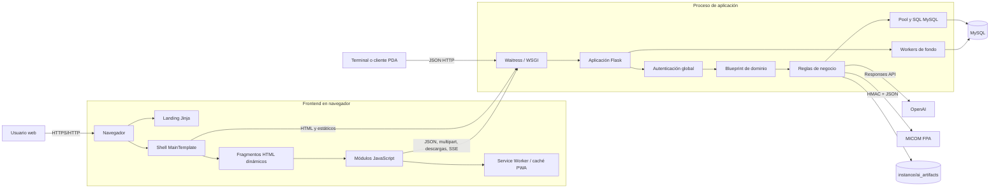
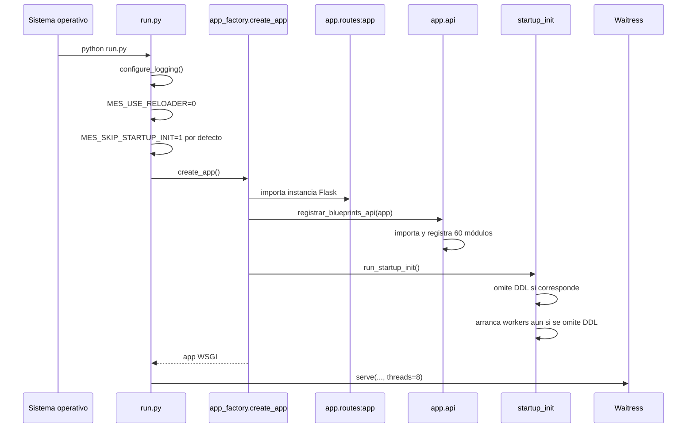
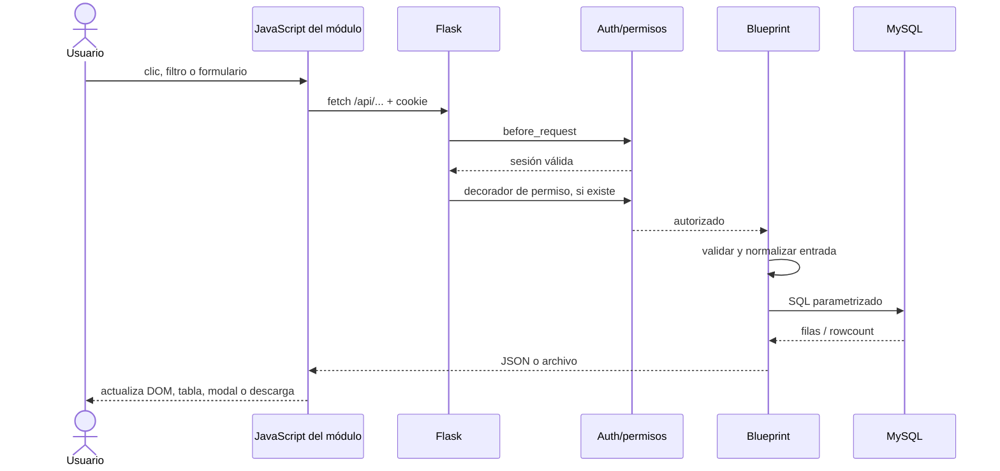
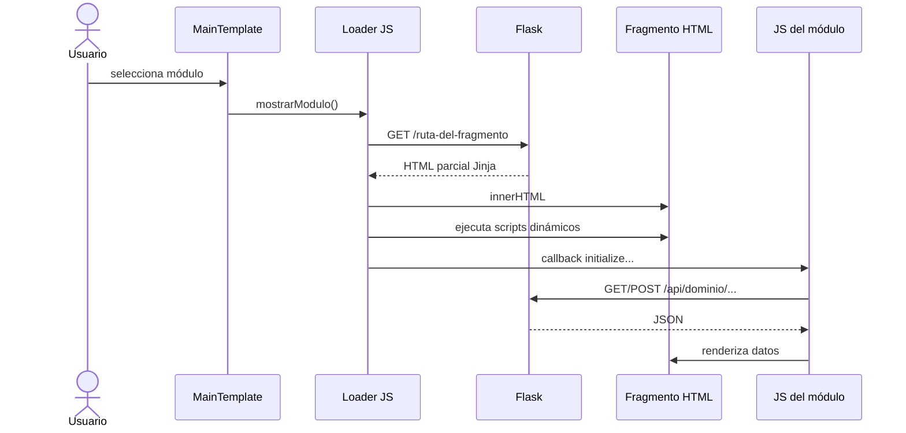
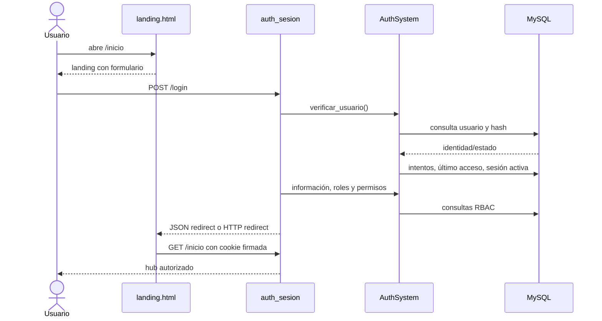
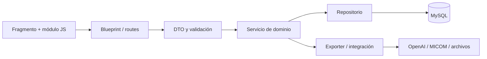

# Reporte detallado de arquitectura del backend y su conexión con el frontend

**Sistema:** ILSAN MES (`MESILSANLOCAL`)  
**Fecha del análisis:** 10 de septiembre de 2026  
**Alcance:** arquitectura observada en el código fuente actual, flujo HTTP, seguridad, persistencia, procesos de fondo, integraciones y acoplamiento frontend-backend.

> Este documento describe el comportamiento que existe en el repositorio. Cuando se distingue entre “actual” y “recomendado”, la primera parte es evidencia del código y la segunda es una propuesta de evolución.

---

## 1. Conceptos utilizados en el reporte

| Concepto | Definición aplicada en este documento |
|---|---|
| **Backend** | Código que se ejecuta en el servidor. Recibe solicitudes HTTP, autentica usuarios, aplica permisos, ejecuta reglas de negocio, consulta MySQL y devuelve HTML, JSON o archivos. |
| **Frontend** | Código que se ejecuta en el navegador: HTML, CSS y JavaScript. Presenta la interfaz, captura acciones del usuario y llama al backend. |
| **Flask** | Framework web de Python usado para construir la aplicación, sus rutas, sesiones, plantillas y respuestas HTTP. |
| **WSGI** | Contrato estándar entre una aplicación web Python y el servidor que la publica. Waitress sirve la aplicación Flask en la ejecución local. |
| **Application factory** | Función que compone e inicializa la aplicación. En este proyecto es `create_app()` y registra los módulos antes de devolver la instancia Flask. |
| **Blueprint** | Módulo de rutas Flask registrable. Permite dividir el monolito por dominios sin convertir cada dominio en un servicio independiente. |
| **Ruta o endpoint** | Combinación de URL y método HTTP que ejecuta una función del backend; por ejemplo, `GET /api/plan` o `POST /login`. |
| **API** | Conjunto de endpoints usados por JavaScript u otros clientes. En este proyecto predominan respuestas JSON, aunque también hay descargas y streaming. |
| **Jinja / renderizado en servidor** | Mecanismo con el que Flask transforma una plantilla HTML y datos del backend en HTML listo para el navegador. |
| **Fragmento HTML** | Vista parcial, sin navegación completa, que el frontend descarga e inserta dentro del shell principal. Los archivos `*_ajax.html` cumplen principalmente esta función. |
| **AJAX** | Solicitud HTTP iniciada por JavaScript sin recargar toda la página. Aquí se implementa con `fetch`, Axios y algunos usos heredados de `XMLHttpRequest`. |
| **JSON** | Formato usado para intercambiar datos estructurados entre los módulos JavaScript y las APIs Flask. |
| **SPA-like / “sensación de SPA”** | Navegación parecida a una Single Page Application, pero sin React, Vue o Angular. El shell permanece y los módulos se sustituyen dinámicamente. |
| **Sesión** | Estado autenticado asociado al usuario. Flask lo representa mediante una cookie firmada que contiene campos como usuario, roles y permisos. |
| **Cookie firmada** | Cookie cuya integridad se valida con `SECRET_KEY`. El usuario puede verla, pero no debería poder alterarla sin invalidar la firma. No equivale a cifrado. |
| **Autenticación** | Verificación de identidad: confirmar usuario y contraseña. |
| **Autorización / RBAC** | Decisión de qué puede hacer un usuario según roles y permisos. RBAC significa *Role-Based Access Control*. |
| **Hook `before_request`** | Función que Flask ejecuta antes de cada endpoint. El proyecto la usa como barrera global de autenticación. |
| **Capa de datos** | Código que abre conexiones y ejecuta consultas contra MySQL. No hay ORM; se usa SQL escrito manualmente. |
| **Pool de conexiones** | Conjunto reutilizable de conexiones MySQL. Evita crear una conexión TCP nueva en cada consulta. |
| **Transacción** | Grupo de cambios que debe confirmarse completo con `commit()` o deshacerse con `rollback()`. |
| **DDL / migración** | SQL que crea o modifica estructura de base de datos, como `CREATE TABLE` o `ALTER TABLE`. |
| **Worker** | Hilo o proceso de fondo que ejecuta tareas periódicas sin depender de una solicitud del navegador. |
| **SSE** | *Server-Sent Events*: flujo de eventos de texto enviado progresivamente por HTTP. El asistente IA usa este formato sobre un `fetch` POST. |
| **PWA** | Aplicación web instalable mediante manifiesto y Service Worker. |
| **Service Worker** | Script del navegador que intercepta solicitudes y administra caché/offline. |
| **Same-origin** | Frontend y backend comparten esquema, host y puerto. Esto permite enviar la cookie de sesión sin configurar CORS para la interfaz principal. |
| **Idempotencia** | Propiedad por la que repetir una operación con la misma clave no debe duplicar sus efectos. La integración FPA utiliza `Idempotency-Key`. |
| **Auditoría** | Registro persistente de quién ejecutó una acción, cuándo, desde qué endpoint y con qué resultado. |
| **Monolito modular** | Una sola aplicación desplegable y una sola base de datos, pero con el código separado por dominios y blueprints. Es la categoría arquitectónica actual del sistema. |

---

## 2. Resumen ejecutivo

ILSAN MES es un **monolito modular Flask, renderizado en servidor y respaldado exclusivamente por MySQL**. El proceso se publica como una sola aplicación WSGI. `app_factory.py` compone la instancia definida en `app/routes.py`, registra 60 módulos de `app/api/` y arranca inicializaciones y workers.

El frontend es una combinación de:

1. páginas completas Jinja (`landing.html`, `MainTemplate.html`);
2. menús y vistas parciales cargados por AJAX;
3. JavaScript Vanilla organizado por módulo;
4. APIs JSON del mismo origen;
5. descargas Excel/PDF y un flujo SSE para el asistente IA;
6. capacidades PWA mediante `manifest.json` y `sw.js`.

La conexión principal puede resumirse así:

```text
Navegador -> Waitress/WSGI -> Flask -> before_request -> ruta/Blueprint
           -> regla de negocio -> SQL/pool -> MySQL
           <- HTML | JSON | archivo | SSE <-
```

El análisis estático del código actual encontró:

- **60 módulos registrados** como blueprints;
- **585 reglas de URL declarativas** en 61 archivos, sin contar la ruta estática automática de Flask;
- **263 sitios de llamada HTTP** en JavaScript/HTML mediante `fetch`, Axios o `XMLHttpRequest`, sin contar las navegaciones directas usadas para descargar archivos;
- rutas agrupadas por autenticación, administración, información básica, materiales, producción, proceso, calidad, resultados, reportes, portal, PDA y utilidades compartidas.

La arquitectura ya tiene una separación funcional clara, pero todavía conserva módulos grandes donde controlador HTTP, reglas de negocio y SQL viven en el mismo archivo. Los riesgos más relevantes son el hash de contraseñas con SHA-256 sin sal, la ausencia de protección CSRF explícita y el límite de autenticación independiente de las APIs PDA.

---

## 3. Vista de contexto del sistema



### Clasificación arquitectónica

| Dimensión | Estado actual |
|---|---|
| Unidad de despliegue | Una aplicación Python/Flask. |
| Persistencia | Una base MySQL compartida. |
| Organización | Monolito modular por dominios y blueprints. |
| Frontend | Jinja + JavaScript Vanilla + fragmentos AJAX. |
| Comunicación interna | Llamadas Python directas y consultas SQL; no existe un bus interno. |
| Comunicación navegador-servidor | HTTP del mismo origen, cookie de sesión, JSON/HTML/archivos/SSE. |
| Integraciones externas | OpenAI Responses API y MICOM FPA. |
| Procesamiento asíncrono | Hilos daemon dentro del mismo proceso de aplicación. |

---

## 4. Arquitectura del backend

### 4.1 Entradas y ciclo de arranque

Los archivos principales son:

| Archivo | Responsabilidad |
|---|---|
| [`run.py`](../run.py) | Entrada local. Fija valores de arranque, crea la app y la sirve con Waitress en `0.0.0.0:$PORT`, con 8 threads. |
| [`aplication.py`](../aplication.py) | Adaptador WSGI mínimo que importa `app` desde `run.py`. El nombre está escrito con una sola `p` y debe respetarse en cualquier configuración externa. |
| [`app_factory.py`](../app_factory.py) | Application factory, caché por proceso, logging, registro de blueprints y arranque de inicializaciones/workers. |
| [`app/routes.py`](../app/routes.py) | Crea la instancia Flask, configura cookies, error handler, hooks globales, filtros Jinja y las rutas core todavía no migradas. |
| [`migrate.py`](../migrate.py) | Entrada operativa que fuerza el bootstrap DDL y las inicializaciones de base de datos. |

Flujo de arranque:



La factoría es idempotente **dentro de cada proceso** mediante `_cached_app` y `_mes_factory_initialized`. Esta protección no coordina procesos distintos.

### 4.2 Composición mediante blueprints

[`app/api/__init__.py`](../app/api/__init__.py) mantiene `_MODULOS_REGISTRADOS`. Para cada nombre:

1. importa `app.api.<sección>.<módulo>`;
2. exige que el módulo exponga `bp`;
3. descubre blueprints adicionales llamados `bp_*`;
4. evita registrar dos veces el mismo nombre;
5. llama `app.register_blueprint()`.

La lista y el orden son parte de la configuración. Hay incluso compatibilidad dependiente del orden: `smt_historial_simple` se registra antes que `smt_historial` porque ambos conservan una URL histórica.

Módulos registrados por dominio:

| Dominio | Blueprints/módulos |
|---|---|
| `auth` | `sesion` |
| `admin` | `permisos`, `usuarios`, `departamentos` |
| `informacion_basica` | `control_bom`, `control_fpa`, `admin_usuarios_depto`, `gestion_roles_depto`, `control_modelos_smt`, `control_modelos_visor`, `control_material` |
| `control_material` | `material_admin`, `material_invoices`, `inventory_valuation`, `material_compras` |
| `control_calidad` | `smt_historial_simple`, `smt_historial`, `historial_liberacion_lqc`, `historial_liberacion_oqc`, `ppms`, `stations_qa`, `renders` |
| `control_resultados` | `aoi`, inventarios IMD/reparación/exceso, trazabilidad PCB, operadores, historiales ICT/FCT/Vision y sus resúmenes pass/fail |
| `control_reporte` | `production_tracking` |
| `control_produccion` | `po_wo`, `cuchillas_corte`, planes SMT/SMD/ASSY/IMD, vistas/renders, `metal_mask`, `squeegee`, `caja_metal_mask`, `part_planning` |
| `control_proceso` | `almacen_embarques`, pendientes OQC, `renders`, `control_salida_lineas` |
| `shared` | `snapshot_inventario`, `raw_modelos` |
| `portal` | `tickets`, `ai_assistant` |
| `pda` | `shipping`, `shipping_material`, `excess_inventory` |

Los paquetes `*_core`, por ejemplo `invoice_core`, `compras_core`, `costing_core` y `valuation_core`, no son blueprints: contienen servicios, parsers, repositorios, normalizadores, exportadores y DDL usados por las rutas de materiales.

### 4.3 Distribución de rutas

La siguiente tabla cuenta decoradores `@<blueprint>.route/get/post/put/patch/delete` sobre el árbol actual. Los alias apilados cuentan como reglas distintas porque Flask publica una URL por decorador.

| Área | Reglas URL | Archivos con rutas | Función principal |
|---|---:|---:|---|
| Core `app/routes.py` | 21 | 1 | Shell, menús, carga de templates, health y rutas heredadas. |
| Autenticación | 5 | 1 | Inicio, login, logout y perfil. |
| Administración | 43 | 3 | Usuarios, auditoría, roles, permisos y departamentos. |
| Información básica | 70 | 7 | BOM/ECO, catálogos, modelos, material y FPA. |
| Control de material | 40 | 4 | Inventario, facturas, compras y valorización. |
| Control de producción | 129 | 12 | Planes, WO/PO, herramientas SMT y part planning. |
| Control de proceso | 72 | 4 | Almacén de embarques, ajustes, cierres, cajas y salidas de línea. |
| Control de calidad | 42 | 7 | Historiales SMT, liberaciones, PPM y estaciones QA. |
| Control de resultados | 104 | 14 | AOI/ICT/FCT/Vision, inventarios y trazabilidad. |
| Control de reporte | 4 | 1 | Production tracking. |
| Portal | 18 | 2 | Tickets y asistente IA. |
| PDA | 30 | 3 | Shipping, material y exceso móvil. |
| Compartido | 7 | 2 | RAW/modelos y snapshots de inventario. |
| **Total** | **585** | **61** | No incluye la ruta `/static` creada automáticamente por Flask. |

No todas las URLs siguen un estilo REST uniforme. Conviven:

- recursos relativamente REST, como `GET/POST /api/plan`;
- comandos, como `POST /api/plan/status`;
- nombres históricos, como `/listar_bom`;
- rutas de fragmentos, como `/control-modelos-smt-ajax`;
- alias por compatibilidad, incluso rutas con espacios o guiones alternativos.

### 4.4 Pipeline de una solicitud

Para una solicitud web ordinaria, el orden efectivo es:

1. Waitress entrega la solicitud a Flask.
2. Flask resuelve la regla de URL.
3. `require_login_by_default()` se ejecuta antes del endpoint.
4. Si aplica, los decoradores específicos validan sesión y permisos.
5. La ruta normaliza query params, formulario, JSON o archivo multipart.
6. La misma función o un servicio de dominio ejecuta la regla de negocio.
7. Se obtiene una conexión del pool y se ejecuta SQL parametrizado.
8. Se hace `commit()`/`rollback()` cuando el flujo lo requiere.
9. La ruta devuelve HTML, JSON, un archivo o un stream.
10. El error handler global convierte excepciones no HTTP en respuesta 500 y registra el stack trace.



### 4.5 Capa de persistencia

El backend es **MySQL-only**. Los comentarios y fachadas todavía reflejan la migración histórica desde SQLite, pero el fallback SQLite fue retirado.

#### Componentes

| Componente | Papel actual |
|---|---|
| [`app/config_mysql.py`](../app/config_mysql.py) | Configuración, creación de conexiones, pool thread-safe, proxy `PooledMySQLConnection`, context manager y `execute_query()`. |
| [`app/db.py`](../app/db.py) | Fachada de compatibilidad. Reexporta operaciones, prueba MySQL al importarse y ofrece `get_db_connection()` con `DictCursor`. |
| [`app/db_mysql.py`](../app/db_mysql.py) | Bootstrap histórico y funciones de datos/negocio para materiales, inventario, usuarios y configuración. |
| Módulos de dominio | La mayoría contiene consultas SQL directamente. |
| Paquetes `*_core` | Separación más nueva para facturas, compras, costeo y valorización. |

#### Pool

El pool es una lista en memoria protegida por `threading.Lock`. Su comportamiento es:

- reutiliza conexiones y ejecuta `ping(True)` antes de entregarlas;
- `close()` en el proxy devuelve la conexión al pool;
- si el pool está lleno o la conexión murió, la conexión física se cierra;
- `_MAX_POOL_SIZE` usa `MYSQL_POOL_SIZE`, con **3 como valor predeterminado en código**;
- `.env.example` propone **50**, una diferencia operativa que debe dimensionarse contra threads, procesos y límite del servidor MySQL;
- cada proceso WSGI mantiene su propio pool, por lo que el máximo global es aproximadamente `pool_size × procesos`.

`execute_query()` devuelve diccionarios con `DictCursor`. Para `SELECT`, requiere `fetch="one"` o `fetch="all"`; para escritura devuelve `rowcount`. Los fallos de DML y lectura se relanzan; parte de los errores DDL se tolera para conservar el arranque idempotente.

#### Transacciones

Hay dos patrones:

1. consultas individuales mediante `execute_query()`;
2. flujos multisentencia que abren `get_db_connection()`, crean cursor y administran `commit/rollback/finally` manualmente.

No existe una Unit of Work ni un ORM que haga uniforme esta frontera. Por ello, la atomicidad depende de cada módulo.

#### Familias principales de tablas

Esta lista es representativa, no un diccionario exhaustivo de todas las tablas y vistas referenciadas:

| Familia | Tablas/vistas representativas |
|---|---|
| Identidad y acceso | `usuarios_sistema`, `roles`, `usuario_roles`, `permisos`, `rol_permisos`, `permisos_botones`, `rol_permisos_botones`, `permiso_departamentos`, `sesiones_activas`, `auditoria`. |
| Catálogos y BOM/ECO | `materiales`, `material_costos`, `raw`, `raw_smd`, `ks_bom_headers`, `ks_bom_components`, `engineering_changes`, `engineering_change_scope`, `engineering_change_diff`, `engineering_change_bom_items`, `v_ecos_bom_current`. |
| Planeación y producción | `work_orders`, `plan_main`, `plan_smt`, `plan_imd`, `plan_smd`, `plan_smd_runs`, `input_main`, `lg_lote_plan`, `lg_schedule_daily`, `lg_plan_daily`, `lg_plan_proposals`, `lg_plan_proposal_items`. |
| Material y costeo | `control_material_almacen`, `control_material_salida`, `inventario_lotes`, `inventario_lote_costos`, `material_invoices`, `material_invoice_lines`, `material_invoice_packing_lines`, `material_invoice_lot_links`, `lista_compras_cargas`, `lista_compras_lineas`. |
| Embarques y OQC | `shipping_entries`, `box_scans`, `oqc_release_boxes`, `embarques`, `embarques_movimiento_cajas`, `exit_records`, `pending_boxes`. |
| Calidad y resultados | `history_ict`, `fct_test_results`, `history_vision`, `stations_qa`, `historial_estaciones_qa`, `tracking`, `pcb_inventory_scan_smd`, `pcb_inventory_scan_prod`, tablas de trazabilidad de material. |
| Herramientas SMT | `masks`, `metal_mask_history`, `storage_boxes`, `cuchillas_corte_config_linea`, `cuchillas_corte_config_modelo`, `cuchillas_corte_sesiones`, `cuchillas_corte_eventos`. |
| Portal e IA | `support_tickets`, `support_ticket_messages`, `ai_conversations`, `ai_messages`, `ai_artifacts`, `ai_usage_limits`. |

### 4.6 Autenticación, sesión y autorización

#### Sesión del portal web

[`app/api/auth/sesion.py`](../app/api/auth/sesion.py) administra el portal:

- `GET /` redirige a `/inicio`;
- `GET /inicio` renderiza la landing con o sin sesión;
- `GET /login` vuelve a la landing;
- `POST /login` valida credenciales en MySQL;
- `GET /logout` audita y limpia la cookie;
- `GET/POST /api/mi-perfil` consulta o actualiza perfil y contraseña.

Tras un login correcto, la cookie de sesión contiene al menos:

- `usuario`;
- `nombre_completo`, `email`, `departamento`;
- `permisos` por módulo/acción;
- `roles` y `rol_principal`;
- marca de último refresco de actividad.

`SECRET_KEY` es obligatoria; la app falla al arrancar si no está definida. La cookie se configura con:

- nombre configurable, predeterminado `mes_ilsan_session`;
- `HttpOnly=true`;
- `SameSite=Lax`;
- `Secure` controlado por `MES_SESSION_COOKIE_SECURE`;
- path `/`.

#### Defensa por defecto

`require_login_by_default()` protege todas las rutas resueltas, excepto:

- endpoints públicos explícitos (`/`, `/inicio`, `/login`, health, favicon y estáticos);
- rutas API PDA incluidas en `public_routes.py`;
- la ruta estática de un blueprint.

Si falta sesión:

- una solicitud API/JSON/AJAX recibe `401` con `redirect: /login`;
- una navegación HTML recibe redirect a la landing.

#### Niveles de permiso

Hay dos modelos complementarios:

1. **módulo/acción**, almacenado en sesión y validado por `AuthSystem.requiere_permiso()`;
2. **página/sección/botón**, validado por `requiere_permiso_dropdown()` y por filtros Jinja/JavaScript.

Los permisos de botón se consultan en MySQL y se guardan en una caché local por proceso con TTL predeterminado de 300 segundos. `superadmin` tiene bypass. La fachada canónica está en [`app/api/shared/permisos.py`](../app/api/shared/permisos.py).

La UI oculta o deshabilita controles, pero la protección real debe estar en el decorador del endpoint. Ocultar un botón nunca sustituye autorización del servidor.

#### Auditoría

`AuthSystem.registrar_auditoria()` persiste usuario, módulo, acción, descripción, datos antes/después, IP, user-agent, resultado, duración, endpoint, método y fecha. Se usa para login/logout, acciones protegidas e integraciones sensibles.

### 4.7 Inicialización de esquema y workers

[`app/startup_init.py`](../app/startup_init.py) separa el bootstrap pesado del import de rutas.

Cuando el bootstrap está habilitado, ejecuta DDL idempotente para:

- esquema general y autenticación;
- shipping, material shipping y exceso;
- cuchillas y snapshots;
- planes SMT/SMD y trazabilidad;
- índices ICT;
- metal mask;
- material/costos, facturas y compras;
- part planning;
- tablas del asistente IA.

Aunque `MES_SKIP_STARTUP_INIT=1`, se arrancan tres workers:

| Worker | Responsabilidad |
|---|---|
| Cuchillas de corte | Sincronización periódica de consumo, prealertas y vencimiento. |
| Snapshot de inventario | Capturas periódicas de inventario. |
| Limpieza de artefactos IA | Elimina o marca archivos expirados según retención. |

Todos viven en el proceso web. En una topología con múltiples procesos o réplicas, cada uno puede intentar arrancar su propia copia; la idempotencia local no es coordinación distribuida.

### 4.8 Integraciones externas

#### OpenAI

El módulo de IA usa la **Responses API** exclusivamente desde el servidor:

- la clave `OPENAI_API_KEY` no llega al navegador;
- el modelo se selecciona con `OPENAI_MODEL`;
- se usa `safety_identifier` derivado por HMAC del usuario;
- el servidor limita requests, tokens, herramientas y artefactos;
- las herramientas locales consultan reportes autorizados y algunas operaciones de plan exigen preparación y confirmación posterior;
- Excel/PowerPoint se guardan de forma privada en `instance/ai_artifacts` y se descargan por endpoints autenticados.

#### MICOM / Control de FPA

El navegador llama a MES; MES funciona como proxy autorizado hacia MICOM:

```text
Frontend -> /api/control-fpa/... -> MES -> MICOM_API_URL/api/fpa/...
```

Cada llamada MES → MICOM incluye:

- timestamp;
- hash SHA-256 del cuerpo;
- firma HMAC-SHA256 con `MICOM_INTEGRATION_SECRET`;
- usuario actor;
- `Idempotency-Key` al crear solicitudes;
- timeouts de conexión/lectura.

El secreto permanece del lado servidor y las exportaciones pueden transmitirse en streaming.

### 4.9 Errores y observabilidad

El logging se configura una sola vez mediante [`app/api/shared/logging_config.py`](../app/api/shared/logging_config.py): stdout, UTF-8, timestamp, nivel y nombre del logger. `MES_LOG_LEVEL` controla el nivel.

El error handler global:

- deja pasar `HTTPException` como 404/403/405;
- registra excepciones no atrapadas con stack trace;
- devuelve JSON genérico para `/api`, `Accept: application/json` o `X-Requested-With: XMLHttpRequest`;
- devuelve texto genérico para HTML.

Los módulos todavía contienen muchos `try/except` propios, por lo que el formato de error no es totalmente uniforme (`error`, `message`, `success`, `codigo`, etc.). No se observa una plataforma de trazas distribuidas ni métricas; la observabilidad central actual es logging + health check + auditoría en MySQL.

---

## 5. Arquitectura del frontend

### 5.1 Tecnologías y organización

No hay `package.json`, bundler ni framework SPA. El frontend usa:

- plantillas Jinja en `app/templates/`;
- CSS modular en `app/static/css/` más hojas globales;
- JavaScript Vanilla en `app/static/js/`;
- Bootstrap 5.3.2, Bootstrap Icons y Font Awesome desde CDN;
- Axios y SheetJS/XLSX vendorizados localmente;
- `fetch` como cliente HTTP dominante;
- manifiesto y Service Worker para PWA.

El resultado es una interfaz de “SPA ligera” con funciones globales en `window`, callbacks de inicialización y contratos basados en IDs del DOM.

### 5.2 Páginas raíz

| Vista | Backend | Papel |
|---|---|---|
| `landing.html` | `/inicio` | Hub de aplicaciones, formulario de login cuando no hay sesión y edición de perfil cuando existe. |
| `MainTemplate.html` | `/ILSAN-ELECTRONICS` | Shell principal del MES: navegación, sidebars, áreas de contenido, tabs y scripts globales. |
| Templates `LISTAS/` | `/listas/...` o `/cargar_template` | Contenido de los menús laterales por área funcional. |
| Templates `*_ajax.html` | Rutas específicas de cada blueprint | Fragmentos de cada módulo insertados dentro del shell. |

### 5.3 Carga dinámica de módulos

El patrón más frecuente es:

1. el usuario selecciona una sección del navbar;
2. el frontend descarga el sidebar correspondiente;
3. un elemento del sidebar invoca una función global `mostrar...()`;
4. la función prepara el área y oculta otros contenedores;
5. `cargarContenidoDinamico(containerId, templatePath, callback)` solicita un fragmento HTML;
6. el HTML se inserta con `innerHTML`;
7. se recrean los `<script>` incluidos en el fragmento;
8. se ejecuta el callback de inicialización del módulo;
9. el JavaScript del módulo solicita sus datos a `/api/...`;
10. la respuesta actualiza tablas, filtros, modales y gráficas.



[`app/static/js/ajax-content-manager.js`](../app/static/js/ajax-content-manager.js) ofrece una variante que:

- analiza el HTML recibido;
- espera que carguen sus hojas de estilo;
- inserta el contenido inicialmente oculto para evitar parpadeo;
- ejecuta scripts externos e inline;
- reinicializa dropdowns y permisos;
- ejecuta teardown de módulos como Metal Mask.

`MainTemplate.html` también contiene un loader más amplio con `AbortController`, gestión de errores 401/403, carga de sidebars, tabs y callbacks. En la práctica existen dos mecanismos de carga dinámica que comparten responsabilidades.

### 5.4 Conexión HTTP desde JavaScript

Los módulos usan URLs relativas, por ejemplo:

```javascript
const response = await fetch('/api/bom/revisions?modelo=...');
const data = await response.json();
```

Al ser same-origin:

- el navegador envía la cookie Flask automáticamente en `fetch` ordinario;
- algunos loaders lo hacen explícito con `credentials: 'same-origin'` o `include`;
- no se requiere CORS para el portal;
- un 401 indica sesión ausente/expirada y un 403 indica permiso insuficiente.

La interfaz intercambia cuatro clases de respuesta:

| Tipo | Uso | Ejemplos |
|---|---|---|
| HTML completo | Landing y shell. | `/inicio`, `/ILSAN-ELECTRONICS`. |
| Fragmento HTML | Vista de un módulo. | `/control-modelos-smt-ajax`, `/historial_vision/ajax`. |
| JSON | Datos y comandos. | `/api/plan`, `/api/ecos`, `/api/material_admin/...`. |
| Archivo/stream | Excel, PDF, imágenes y SSE. | exports, descargas IA, `messages/stream`. |

Las cargas de Excel/CSV/adjuntos utilizan `FormData` y `multipart/form-data`. Las descargas suelen usar un enlace o `window.location`, de modo que no todas aparecen en el conteo de `fetch`.

### 5.5 Streaming del asistente IA

El flujo IA no usa `EventSource`, porque necesita un POST con JSON y adjuntos previamente cargados:

1. el frontend crea o abre una conversación;
2. opcionalmente sube archivos;
3. ejecuta `POST /api/ai/conversations/<id>/messages/stream`;
4. el backend abre la respuesta OpenAI y produce frames SSE;
5. el frontend lee `response.body.getReader()` y procesa eventos `delta`, herramientas, visualizaciones, artefactos, uso y errores;
6. los archivos generados se descargan después mediante un endpoint autenticado.

### 5.6 PWA y caché

`app/static/manifest.json` declara el sistema como aplicación instalable y `app/static/sw.js`:

- precarga el shell y recursos esenciales;
- usa network-first para HTML;
- usa cache-first para estáticos;
- elimina versiones antiguas del caché;
- incluye hooks para instalación, notificaciones y background sync futuro.

El Service Worker no es una capa de sincronización de datos MES: los POST no se interceptan y el `doBackgroundSync()` actual es un placeholder.

---

## 6. Cómo se conecta el frontend con el backend

### 6.1 Contrato principal: cookie + mismo origen

La interfaz corporativa y Flask viven bajo el mismo origen. La cookie firmada es el vínculo de identidad. No hay un token Bearer en las llamadas normales del portal.

```text
Cookie mes_ilsan_session
  └─ usuario / roles / permisos
       ├─ before_request: exige usuario
       ├─ decorador de módulo/acción
       ├─ decorador de página/sección/botón
       └─ endpoint de dominio
```

### 6.2 Flujo de autenticación del portal



### 6.3 Flujo de un módulo empresarial

Ejemplo BOM/ECO:

```text
MainTemplate
  -> carga fragmento Control de BOM
  -> control_bom.js
  -> GET /api/bom/revisions
  -> POST /listar_bom
  -> POST /api/ecos/from-excel
  -> GET /api/ecos/<id>/diff
  -> POST /api/ecos/<id>/approve
  -> descarga /api/bom/download-excel
```

El blueprint `control_bom` valida sesión/permisos, usa servicios/helpers de BOM, consulta las tablas canónicas y devuelve JSON o Excel. Este patrón se repite en planes, inventarios, calidad y embarques.

### 6.4 Flujo PDA

Las APIs móviles viven bajo `/api/shipping` y `/api/shipping/excess`. Su frontera es distinta:

- `POST /api/shipping/auth/login` valida credenciales;
- la respuesta devuelve el objeto del usuario;
- las rutas PDA están exceptuadas del hook de sesión web mediante una allowlist;
- el código actual no vincula el login PDA a una cookie de servidor ni devuelve/verifica un token Bearer;
- varias operaciones posteriores reciben o consultan IDs de usuario desde el cliente.

Por tanto, el login PDA funciona actualmente como validación inicial del cliente, no como una credencial de servidor comprobada en cada petición. Esta diferencia debe considerarse explícitamente al diseñar o exponer esos endpoints.

### 6.5 Matriz de responsabilidades

| Responsabilidad | Frontend | Backend |
|---|---|---|
| Presentar/ocultar controles | Sí | Proporciona contexto de permisos. |
| Validación para UX | Sí | No es confiable por sí sola. |
| Validación autoritativa | No | Sí. |
| Autenticación | Envía credenciales y cookie | Verifica hash, bloqueo y estado. |
| Autorización | Ajusta la UI | Debe negar el endpoint con 401/403. |
| Reglas de negocio | Sólo interacción/presentación | Sí. |
| SQL | Nunca | Sí, mediante pool. |
| Archivos Excel/PDF | Solicita, sube o descarga | Valida, procesa, genera y transmite. |
| Secretos | Nunca | Variables de entorno. |
| Integración OpenAI/MICOM | Consume endpoints MES | Firma/autoriza y llama al proveedor. |

---

## 7. Mapa físico del repositorio

```text
MESILSANLOCAL/
├── run.py                         # servidor local Waitress
├── aplication.py                  # adaptador WSGI
├── app_factory.py                 # composición de la aplicación
├── migrate.py                     # bootstrap DDL forzado
├── requirements*.txt              # dependencias Python
├── app/
│   ├── routes.py                  # instancia Flask y rutas core
│   ├── auth_system.py             # identidad, RBAC y auditoría
│   ├── config_mysql.py            # pool y ejecución SQL
│   ├── db.py                      # fachada MySQL
│   ├── db_mysql.py                # bootstrap y funciones legacy
│   ├── startup_init.py            # DDL y workers
│   ├── api/
│   │   ├── __init__.py            # registro central de blueprints
│   │   ├── auth/                  # sesión del portal
│   │   ├── admin/                 # usuarios, permisos, departamentos
│   │   ├── informacion_basica/    # BOM, modelos, material, FPA
│   │   ├── control_material/      # almacén, facturas, compras, valor
│   │   ├── control_produccion/    # planes, PO/WO, herramientas SMT
│   │   ├── control_proceso/       # embarques y salidas de línea
│   │   ├── control_calidad/       # QA, PPM, liberaciones
│   │   ├── control_resultados/    # historiales y trazabilidad
│   │   ├── control_reporte/       # tracking
│   │   ├── portal/                # tickets e IA
│   │   ├── pda/                   # APIs móviles
│   │   └── shared/                # fachadas y servicios transversales
│   ├── services/                  # clientes/servicios sin rutas
│   ├── templates/                 # páginas y fragmentos Jinja
│   └── static/                    # CSS, JS, imágenes, PWA
├── instance/                      # datos privados locales, artefactos IA
├── tests/                         # pruebas Python y una prueba JS
├── Documentacion/                 # documentación técnica
└── .github/workflows/             # CI
```

---

## 8. Configuración y despliegue

### 8.1 Variables de entorno principales

| Grupo | Variables |
|---|---|
| MySQL | `MYSQL_HOST`, `MYSQL_PORT`, `MYSQL_DATABASE`, `MYSQL_USER`/`MYSQL_USERNAME`, `MYSQL_PASSWORD`, `MYSQL_POOL_SIZE`, timeouts. |
| Flask/sesión | `SECRET_KEY`, `MES_ENV`, `MES_SESSION_COOKIE_NAME`, `MES_SESSION_COOKIE_SECURE`. |
| Arranque | `MES_SKIP_STARTUP_INIT`, `MES_FORCE_STARTUP_INIT`, `MES_USE_RELOADER`, `PORT`. |
| Logging | `MES_LOG_LEVEL`. |
| Autenticación | `MES_ADMIN_PASSWORD`, `PERMISSIONS_CACHE_TTL_SECONDS`. |
| IA | `OPENAI_API_KEY`, `OPENAI_MODEL`, `AI_SAFETY_HMAC_KEY` y límites `AI_*`. |
| MICOM | `MICOM_API_URL`, `MICOM_INTEGRATION_SECRET`. |

`.env` se carga desde la raíz. No deben versionarse sus valores reales.

### 8.2 Topología activa observada

La topología respaldada por los archivos actuales es servidor local:

```text
Cliente LAN -> host:PORT -> Waitress (8 threads) -> Flask -> MySQL
```

El workflow de GitHub Actions ya no despliega. Sólo:

1. usa Python 3.11;
2. instala dependencias MySQL;
3. compila sintaxis;
4. ejecuta `pytest -q` con startup pesado omitido.

Aunque documentación anterior menciona Azure/Vercel, en el checkout actual no existen `vercel.json`, `api/index.py`, `runtime.txt`, Dockerfile ni workflow de despliegue. Gunicorn continúa como dependencia, pero `run.py` usa Waitress.

### 8.3 Health check

`GET /api/health` ejecuta `SELECT 1` y devuelve:

- estado del servicio;
- estado de base de datos;
- timestamp de México.

El endpoint responde incluso si MySQL falla, marcando `database: error`. Es útil para distinguir proceso vivo de dependencia saludable.

---

## 9. Pruebas y verificabilidad

El repositorio contiene 28 archivos bajo `tests/`, entre ellos pruebas para:

- smoke test de la app;
- sesión y seguridad;
- fachada de base de datos;
- permisos;
- BOM/ECO;
- almacén, compras, facturas y FPA;
- part planning y propuestas de plan;
- historiales ICT/Vision/OQC;
- producción e IA.

La CI compila `app`, `app_factory.py` y `run.py`, y después ejecuta Pytest. No se observa una etapa de lint/formato, análisis de tipos, pruebas de navegador completas ni migraciones contra una base efímera real.

---

## 10. Hallazgos y riesgos arquitectónicos

### 10.1 Prioridad crítica

#### A. Hash de contraseña insuficiente

`AuthSystem.hash_password()` usa SHA-256 directo, sin sal ni factor de costo. SHA-256 es rápido y no es un password KDF. Una filtración de hashes permitiría ataques offline eficientes.

**Recomendación:** migrar a Argon2id, scrypt o bcrypt mediante Werkzeug/passlib, conservar verificación temporal del hash antiguo y rehashear al siguiente login exitoso.

#### B. Frontera de autenticación PDA

La allowlist omite la sesión web para numerosas rutas `/api/shipping`, pero el login móvil no crea una sesión de servidor ni emite un token que las operaciones posteriores verifiquen.

**Recomendación:** emitir una sesión segura o access token corto, validarlo en cada ruta PDA, comprobar permisos en servidor y separar con claridad rutas verdaderamente públicas de rutas autenticadas.

#### C. CSRF

No se observa token CSRF ni extensión equivalente. `SameSite=Lax` reduce escenarios cross-site, pero no constituye una política CSRF completa y no protege frente a todos los casos same-site o endpoints GET con efectos laterales.

**Recomendación:** incorporar protección CSRF central para operaciones con cookie, revisar que GET sea sólo lectura y estandarizar envío del token desde `fetch`/Axios.

### 10.2 Prioridad alta

#### D. Workers dentro del servidor web

Los workers se arrancan por proceso y no existe un lock distribuido visible. Con dos procesos o dos hosts pueden duplicarse capturas, limpieza o sincronización.

**Recomendación:** mover tareas a un scheduler/worker dedicado o usar una lease en MySQL con expiración y owner.

#### E. DDL embebido sin migraciones versionadas

El esquema se actualiza con funciones idempotentes distribuidas. Esto facilita el primer arranque, pero dificulta conocer versión, ordenar cambios, hacer rollback y reproducir producción.

**Recomendación:** introducir Alembic o un runner SQL versionado; dejar el startup web sólo para validar la versión esperada.

#### F. Acoplamiento en módulos grandes

Algunos archivos contienen rutas, validación, SQL, exportación y reglas de negocio. `almacen_embarques.py`, `ai_assistant.py`, planes y BOM son ejemplos de alta concentración.

**Recomendación:** conservar el monolito, pero aplicar por dominio `routes -> service -> repository/exporter`, siguiendo los paquetes `invoice_core` y `compras_core`.

#### G. Estado y cachés locales por proceso

La caché de permisos, el pool, la app cacheada y los flags de workers viven en memoria local. En múltiples procesos, un cambio de permisos puede tardar el TTL y la invalidación de un proceso no invalida los demás.

**Recomendación:** versión de permisos en MySQL/Redis, invalidación compartida o TTL menor acompañado de observabilidad.

### 10.3 Prioridad media

#### H. Dos loaders dinámicos y contratos globales

`MainTemplate.html` y `ajax-content-manager.js` solapan carga, scripts, estilos y reinicialización. Muchos módulos exponen funciones en `window` y dependen de IDs globales.

**Consecuencia:** colisiones, inicialización doble, listeners duplicados, teardown incompleto y cambios difíciles de aislar.

**Recomendación:** un solo `ModuleLoader` con interfaz `mount/unmount`, registro por nombre y ownership de listeners, modales y estilos.

#### I. Ejecución de scripts inline de fragmentos

El loader recrea scripts insertados mediante `innerHTML`. Los templates son del propio servidor, pero este patrón amplifica el impacto de una inyección HTML y dificulta adoptar una Content Security Policy estricta.

**Recomendación:** mover lógica inline a archivos estáticos y permitir que el loader invoque una función registrada, sin ejecutar scripts arbitrarios del fragmento.

#### J. Contrato API y errores heterogéneos

Conviven URLs REST, comandos y rutas legacy; las respuestas usan formatos de éxito/error distintos.

**Recomendación:** para rutas nuevas, adoptar un contrato versionado y uniforme, por ejemplo `{success, data, error:{code,message,details}, meta}`; conservar adaptadores sólo donde haya consumidores legacy.

#### K. Conexión a MySQL durante import

`app/db.py` prueba la conexión al importarse. Esto acopla carga de módulos con disponibilidad de red/DB y aumenta latencia y efectos laterales de importación.

**Recomendación:** inicializar el pool de forma lazy y hacer readiness explícito sin bloquear la construcción del grafo de rutas.

#### L. Sesión activa no vinculada explícitamente a la cookie

El login crea un token en `sesiones_activas`, pero ese token no se coloca en la sesión Flask ni se valida por petición. La actualización de actividad extiende sesiones activas del usuario y el logout del portal sólo limpia la cookie.

**Recomendación:** vincular un identificador de sesión a la cookie, validar revocación y cerrar exactamente esa sesión en logout.

#### M. Deriva documental y de despliegue

Parte de la documentación anterior todavía menciona archivos y topologías serverless ausentes. Esto puede provocar configuraciones incorrectas.

**Recomendación:** tratar este documento y el workflow actual como base, corregir referencias a `api/index.py`/Vercel/runtime y mantener una matriz explícita de entornos soportados.

---

## 11. Arquitectura objetivo incremental recomendada

No es necesario dividir el sistema inmediatamente en microservicios. El siguiente paso de menor riesgo es fortalecer el monolito modular:



Reglas propuestas:

1. `routes.py` y los blueprints sólo traducen HTTP.
2. Los servicios controlan reglas de negocio y transacciones.
3. Los repositorios contienen SQL y convierten filas a modelos/DTO.
4. Los exportadores generan Excel/PDF fuera de la ruta.
5. Todos los endpoints declaran autenticación y permiso requerido.
6. La API usa errores y paginación uniformes.
7. Los fragmentos no ejecutan scripts inline; registran un módulo `mount/unmount`.
8. Los workers se despliegan de manera independiente o con lease distribuida.
9. El esquema se administra con migraciones versionadas.

### Orden de ejecución sugerido

| Fase | Resultado |
|---|---|
| 1 | Corregir password hashing, autenticación PDA y CSRF. |
| 2 | Crear contrato uniforme de respuesta/error y helpers de validación. |
| 3 | Extraer servicios/repositorios de `almacen_embarques`, planes, BOM e IA. |
| 4 | Introducir migraciones versionadas y eliminar DDL del proceso web. |
| 5 | Consolidar loaders del frontend y formalizar lifecycle de módulos. |
| 6 | Separar workers y agregar métricas/readiness. |

---

## 12. Guía para agregar un módulo nuevo sin aumentar el acoplamiento

### Backend

1. Crear `app/api/<dominio>/<modulo>.py` con `bp`.
2. Definir rutas de fragmento y API por separado.
3. Aplicar `login_requerido` y el permiso granular correspondiente.
4. Colocar negocio en `service.py` y SQL en `repository.py` cuando el módulo no sea trivial.
5. Parametrizar SQL; encapsular la transacción completa en el servicio.
6. Registrar el módulo en `_MODULOS_REGISTRADOS`.
7. Agregar DDL como migración versionada; mientras no exista el runner, integrarlo explícitamente en `startup_init.py`.
8. Agregar pruebas de 401, 403, validación, éxito y rollback.

### Frontend

1. Crear un fragmento `*_ajax.html` sin shell duplicado.
2. Crear CSS con namespace del módulo.
3. Crear JS con `mount(container)` y `unmount()` idempotentes.
4. Usar URLs relativas del mismo origen.
5. Manejar explícitamente 400, 401, 403, 409 y 500.
6. No confiar en controles ocultos para autorizar acciones.
7. Agregar el acceso al sidebar y al catálogo de permisos.
8. Evitar scripts inline y listeners globales sin teardown.

---

## 13. Archivos clave para profundizar

| Tema | Archivo |
|---|---|
| Composición y arranque | [`app_factory.py`](../app_factory.py), [`run.py`](../run.py), [`app/startup_init.py`](../app/startup_init.py) |
| Instancia Flask y hooks | [`app/routes.py`](../app/routes.py) |
| Registro de blueprints | [`app/api/__init__.py`](../app/api/__init__.py) |
| Login y perfil | [`app/api/auth/sesion.py`](../app/api/auth/sesion.py) |
| RBAC y auditoría | [`app/auth_system.py`](../app/auth_system.py), [`app/api/shared/permisos.py`](../app/api/shared/permisos.py) |
| Allowlist PDA | [`app/api/shared/public_routes.py`](../app/api/shared/public_routes.py) |
| Pool y SQL | [`app/config_mysql.py`](../app/config_mysql.py), [`app/db.py`](../app/db.py) |
| Shell web | [`app/templates/MainTemplate.html`](../app/templates/MainTemplate.html) |
| Loader AJAX | [`app/static/js/ajax-content-manager.js`](../app/static/js/ajax-content-manager.js), [`app/static/js/scriptMain.js`](../app/static/js/scriptMain.js) |
| PWA | [`app/static/manifest.json`](../app/static/manifest.json), [`app/static/sw.js`](../app/static/sw.js) |
| IA | [`app/api/portal/ai_assistant.py`](../app/api/portal/ai_assistant.py), [`app/api/portal/ai_openai.py`](../app/api/portal/ai_openai.py), [`app/static/js/ai-assistant.js`](../app/static/js/ai-assistant.js) |
| MICOM/FPA | [`app/api/informacion_basica/control_fpa.py`](../app/api/informacion_basica/control_fpa.py), [`app/services/fpa_micom_client.py`](../app/services/fpa_micom_client.py) |
| CI | [`.github/workflows/main_ilsan-mes.yml`](../.github/workflows/main_ilsan-mes.yml) |

---

## 14. Conclusión

La fortaleza principal de ILSAN MES es que los dominios ya están reconocidos y registrados centralmente: la aplicación dejó de ser un único `routes.py` y opera como un monolito modular con blueprints. El frontend y el backend comparten despliegue y origen, lo que simplifica sesión, plantillas y operación dentro de planta.

El costo de esa evolución incremental es un contrato implícito entre fragmentos, funciones globales, permisos y rutas históricas, además de lógica y SQL todavía concentrados en archivos grandes. La ruta técnica con mejor relación riesgo/beneficio es conservar la unidad de despliegue, cerrar primero las brechas de autenticación/CSRF, formalizar capas dentro de cada dominio, versionar el esquema y unificar el lifecycle de módulos del frontend.
