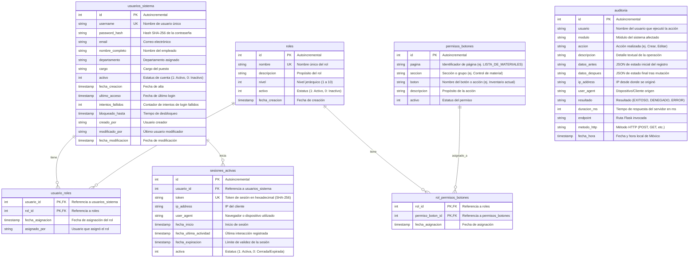
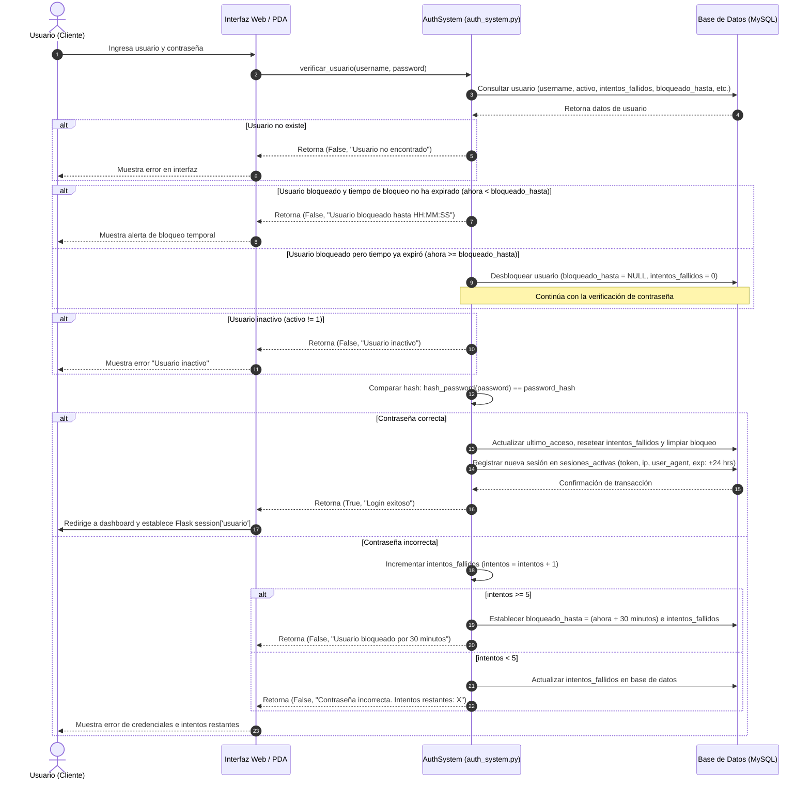
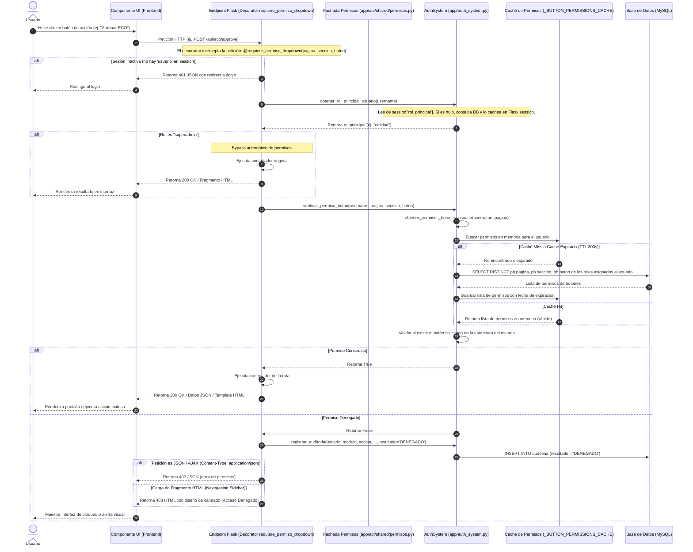
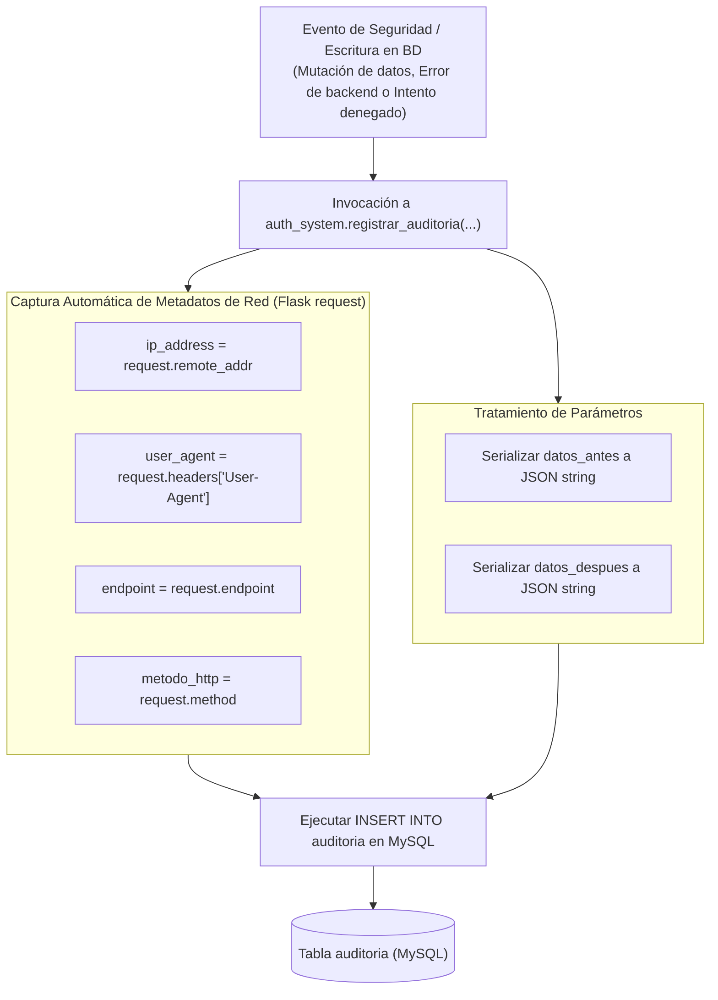

# Documentación Técnica: Sistema de Autenticación y Autorización Basado en Roles (RBAC)

Este documento detalla el funcionamiento lógico, el modelo de datos y los flujos de control del sistema de autenticación y seguridad por roles implementado en **ILSAN MES**.

El sistema utiliza un enfoque de **Control de Acceso Basado en Roles (RBAC - Role-Based Access Control)** con la particularidad de evaluar permisos granulares al nivel de páginas, secciones y botones específicos (Dropdowns/Sidebars) para proveer una experiencia fluida e inyección dinámica de módulos (AJAX).

---

## 1. Arquitectura y Modelo de Datos (DB Schema)

El motor de persistencia del sistema de autenticación corre sobre **MySQL**. A continuación se muestra la estructura y relaciones de las tablas involucradas en el proceso de autenticación, asignación de roles, permisos de interfaz y auditoría:



### Niveles Jerárquicos de Roles Predeterminados

El sistema inicializa automáticamente los siguientes roles y niveles jerárquicos a través de la función `_crear_roles_default` en [app/auth_system.py](file:///c:/Users/yahir/OneDrive/Escritorio/MES/MES/MESILSANLOCAL/app/auth_system.py#L258-L277):

| Rol | Nivel | Descripción |
| :--- | :---: | :--- |
| **superadmin** | `10` | Super Administrador con acceso total (bypassa el chequeo de permisos de botones). |
| **admin** | `9` | Administrador del sistema (acceso casi completo excepto configuraciones críticas). |
| **supervisor_almacen** | `8` | Supervisor del almacén general y almacén de materias primas. |
| **supervisor_produccion** | `7` | Supervisor de líneas de ensamble SMT, ASSY, IMT. |
| **operador_almacen** | `5` | Operador para registrar entradas, salidas e impresiones de etiquetas. |
| **operador_produccion** | `4` | Operador en planta con permisos de registro básico de producción. |
| **calidad** | `3` | Personal de control de calidad (inspecciones IQC, OQC y liberaciones LQC). |
| **consulta** | `2` | Usuario con permisos de visualización general en módulos del MES. |
| **invitado** | `1` | Usuario externo o temporal con privilegios mínimos. |

---

## 2. Flujo de Autenticación (Login & Bloqueo)

Este flujo detalla cómo se procesa una solicitud de inicio de sesión, incluyendo la protección contra ataques de fuerza bruta (bloqueo temporal tras 5 intentos fallidos) y la gestión de sesiones activas.



---

## 3. Flujo de Autorización y Chequeo de Permisos de Botón

La autorización en el MES está optimizada mediante una fachada centralizada y un decorador que intercepta peticiones AJAX y navegación directa. Además, cuenta con un sistema de caché TTL en memoria del servidor Flask para no sobrecargar a la base de datos MySQL con peticiones repetidas.



---

## 4. Sistema de Auditoría y Bitácora de Acciones

El sistema registra de forma obligatoria toda mutación de estado relevante (rutas POST/PUT/DELETE) así como los intentos de acceso no autorizados.



> [!NOTE]
> **Gestión de Fechas**: Las fechas y marcas de tiempo del sistema de auditoría y base de datos son forzadas a la zona horaria de México (GMT-6) mediante métodos estáticos en `AuthSystem` (`get_mexico_time()`, `get_mexico_time_mysql()`), garantizando la homogeneidad horaria incluso si el servidor físico se encuentra en otra zona horaria.

---

## 5. Implementación en Código y Uso de Decoradores

El sistema de seguridad está implementado y centralizado principalmente en dos componentes clave:
1.  **Lógica Central**: [app/auth_system.py](file:///c:/Users/yahir/OneDrive/Escritorio/MES/MES/MESILSANLOCAL/app/auth_system.py), responsable del backend, cifrado, consultas CRUD a base de datos y la caché TTL en memoria.
2.  **Fachada de Permisos (Dropdowns)**: [app/api/shared/permisos.py](file:///c:/Users/yahir/OneDrive/Escritorio/MES/MES/MESILSANLOCAL/app/api/shared/permisos.py), responsable de centralizar el decorador `@requiere_permiso_dropdown` utilizado en los diferentes blueprints del sistema.

### Ejemplo de Integración en Vistas del Servidor

Para proteger cualquier endpoint del sistema, se debe importar y añadir el decorador `@requiere_permiso_dropdown` especificando la **página**, la **sección** y el **botón** configurado en la base de datos:

```python
from flask import Blueprint, jsonify, render_template
# Importar el decorador unificado desde la fachada central de permisos
from app.api.shared import requiere_permiso_dropdown

bp = Blueprint('mi_modulo', __name__)

@bp.route('/mi-ruta-de-accion', methods=['POST'])
@requiere_permiso_dropdown('LISTA_DE_MATERIALES', 'Control de material', 'Historial de entradas')
def mi_controlador():
    # Esta función solo se ejecutará si el usuario:
    # 1. Tiene sesión activa.
    # 2. Es "superadmin" u ostenta un rol que contiene el permiso específico.
    return jsonify({"success": True, "message": "Operación autorizada"})
```

> [!IMPORTANT]
> **Bypass para Superadmin**: Si un usuario tiene asignado el rol `superadmin`, el decorador de permisos ignorará cualquier restricción de botón devolviendo directamente `True` (acceso absoluto). Esto permite realizar labores de soporte de forma ágil sin registrar permisos redundantes para dicho rol.
