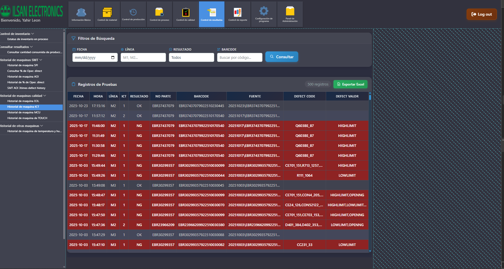

# Solución Implementada para Modales

## Problema Resuelto
Los modales no se veían correctamente después de navegar entre secciones debido a:
1. CSS conflictivo que establecía `opacity: 0` y `display: none`
2. Modales creados dentro de contenedores que se eliminaban al navegar
3. Falta de estilos inline en los modales creados dinámicamente

## Solución Implementada

### 1. Crear Modales Dinámicamente en JavaScript
- Los modales se crean en `createModalsInBody()` directamente en `document.body`
- Se verifican antes de abrir y se recrean si no existen

### 2. Estilos Inline Forzados
- Todos los modales usan `cssText` con estilos inline completos
- Los estilos sobrescriben cualquier CSS conflictivo
- Se incluyen: `display`, `position`, `z-index`, `opacity`, `visibility`

### 3. Modales Implementados

#### ✅ Modal de Nuevo Plan
- Fondo oscuro (#34334E)
- Inputs con fondo (#2B2D3E) y borde azul
- Botones con colores correctos (verde para guardar, gris para cancelar)
- Labels en color claro

#### ✅ Modal de Editar Plan
- Mismo estilo que Nuevo Plan
- Botón rojo para "Cancelar plan"
- Layout con botones a los lados

#### ✅ Modal de Reprogramar
- Fondo oscuro con título morado (#9b59b6)
- Filtros con inputs estilizados
- Tabla con headers oscuros y bordes azules
- Botones morados para acciones

#### ⚠️ Modal de Work Orders
- Se crea con `insertAdjacentHTML` en otra función
- Necesita actualización similar a los otros modales
- Ubicación: función `createWorkOrdersModal()` en plan.js

## Código de Apertura de Modales

```javascript
// Forzar estilos al abrir
modal.style.cssText = `
  display: flex !important;
  position: fixed !important;
  top: 0 !important;
  left: 0 !important;
  width: 100% !important;
  height: 100% !important;
  background: rgba(0,0,0,0.6) !important;
  justify-content: center !important;
  align-items: center !important;
  z-index: 10000 !important;
  opacity: 1 !important;
  visibility: visible !important;
`;
```

## Próximos Pasos

Para completar el modal de Work Orders, actualizar la función `createWorkOrdersModal()` con estilos inline similares a los otros modales.

