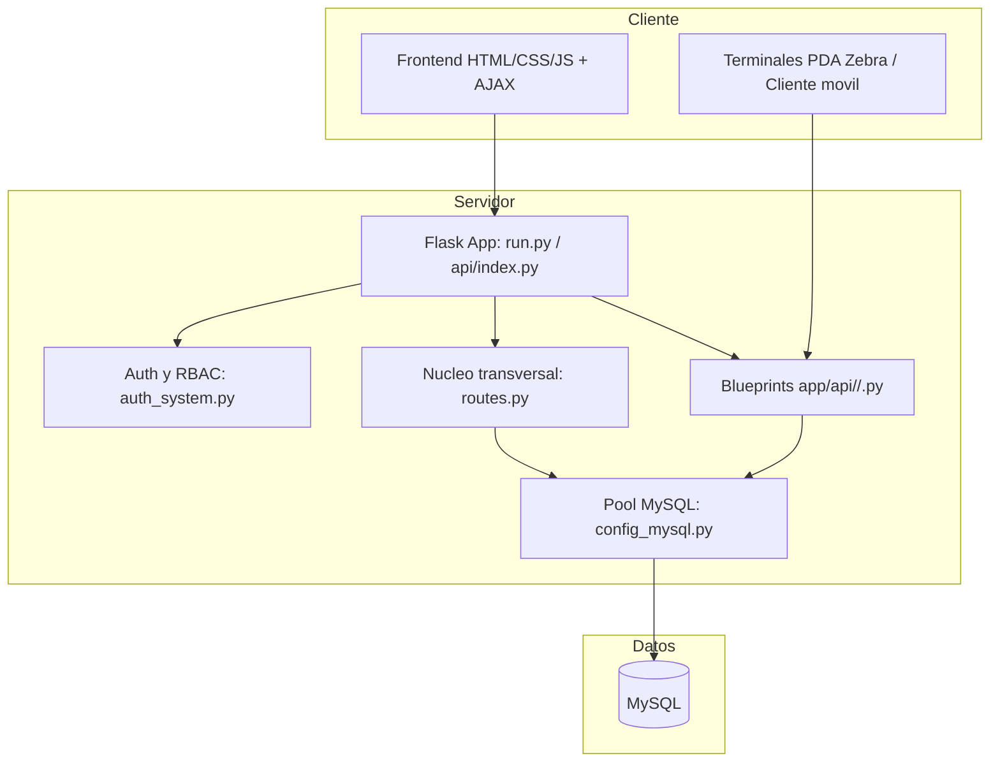
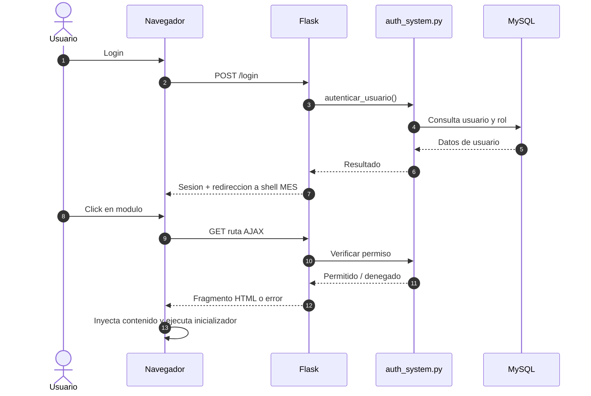

# WF_006 - Manual Tecnico y Operacion del Sistema MES

> **Estado:** Documento homologado
> **Origen:** Consolida `README_TECNICO_MES.md` y `MANUAL_TECNICO_COMPLETO.md`
> **Uso:** Punto de entrada tecnico para entender arquitectura, ejecucion, operacion y mapa documental vigente.

---

## Resumen

El sistema **ILSAN MES** es una aplicacion web Flask para trazabilidad, control de materiales, produccion, calidad, embarques, soporte operativo y administracion de permisos. La interfaz funciona como un shell principal con carga dinamica AJAX de modulos, lo que permite navegar entre secciones sin recargar toda la pagina.

Este documento reemplaza como entrada principal a los documentos legacy de manual general. Los documentos anteriores no se eliminan porque siguen siendo utiles como historial.

## Alcance

- Arquitectura general del sistema.
- Ejecucion local y despliegue serverless.
- Estructura funcional de modulos.
- Acceso a datos MySQL.
- Mapa de documentacion homologada `WF_*`.
- Reglas operativas para mantenimiento.

## Arquitectura General



## Componentes Principales

| Componente | Responsabilidad |
|---|---|
| `run.py` | Entrada local de la aplicacion Flask. |
| `api/index.py` | Entrada serverless cuando aplica. |
| `app/routes.py` | Nucleo transversal, rutas legacy y helpers compartidos. |
| `app/api/` | Blueprints por dominio funcional. |
| `app/api/__init__.py` | Registro central de blueprints. |
| `app/api/shared/__init__.py` | Reexports lazy de helpers comunes. |
| `app/auth_system.py` | Usuarios, roles, permisos, auditoria y login. |
| `app/config_mysql.py` | Pool de conexiones y `execute_query`. |
| `app/templates/MainTemplate.html` | Shell principal del portal. |
| `app/static/js/scriptMain.js` | Navegacion, carga dinamica y funciones `mostrar*`. |

## Dominios Funcionales

| Dominio | Descripcion |
|---|---|
| Informacion Basica | Catalogos base y datos maestros. |
| Control de Material | Recepcion, inventario, administracion y trazabilidad de materiales. |
| Control de Produccion | Planeacion, lineas, WOs y control de produccion. |
| Control de Proceso | BOM, ICT, SMT/SMD y flujos tecnicos de proceso. |
| Control de Calidad | Validaciones, inspecciones y reportes de calidad. |
| Resultados | Analisis de resultados operativos y pruebas. |
| Reportes | Reportes transversales y exportaciones. |
| Configuracion | Usuarios, roles, permisos y configuraciones del sistema. |
| Embarques / PDA | Operacion de almacen terminado y terminales Zebra. |
| Portal IT | Tickets internos y soporte operativo. |

## Flujo de Login y Carga Dinamica



## Quick Start Local

1. Instalar dependencias:

```powershell
pip install -r requirements.txt
```

2. Crear `.env` desde `.env.example` y configurar MySQL, `SECRET_KEY` y variables requeridas.

3. Iniciar servidor:

```powershell
python run.py
```

4. Verificar rutas basicas:

| Ruta | Uso |
|---|---|
| `/` | Health o entrada basica. |
| `/inicio` | Hub posterior a login. |
| `/ILSAN-ELECTRONICS` | Shell principal MES. |

## Mapa Documental Homologado

| Documento | Tema |
|---|---|
| `WF_001_Nuevos_Modulos_AJAX_Templates.md` | Agregar botones, LISTAS y templates al sidebar. |
| `WF_002_Crear_Template_Completo.md` | Crear template HTML/CSS/JS completo. |
| `WF_003_Integracion_API_JS_Template.md` | Integrar API backend, JS frontend y exportacion. |
| `WF_004_Estilos_Persistentes_Modulos_AJAX.md` | CSS persistente en modulos AJAX. |
| `WF_005_Permisos_Dropdowns_Caracteres_Especiales.md` | Permisos de dropdowns con caracteres especiales. |
| `WF_006_Manual_Tecnico_Operacion_MES.md` | Manual tecnico y operacion general. |
| `WF_007_Desarrollo_Modulos_AJAX_Guia_Unificada.md` | Guia unificada para desarrollar modulos AJAX. |
| `WF_008_Modales_Carga_AJAX.md` | Patron correcto de modales con carga AJAX. |
| `WF_009_Autenticacion_RBAC_Permisos.md` | RBAC, login, permisos y auditoria. |
| `WF_010_Refactor_Arquitectura_Backend_UI.md` | Refactors de `routes.py` y contenedor universal. |
| `WF_011_Analisis_Mejoras_Repositorio.md` | Diagnostico de mejoras del repositorio. |
| `WF_012_ICT_Pass_Fail_Modo_Detallado.md` | Modo detallado ICT Pass/Fail. |
| `WF_013_Bug_Tabs_Restaurados_Ancho_Tablas.md` | Bug especifico de tabs restaurados y ancho de tablas. |

## Documentos Legacy Cubiertos

- `README_TECNICO_MES.md`
- `MANUAL_TECNICO_COMPLETO.md`

Los documentos legacy se conservan intactos. Si existe conflicto entre un documento legacy y esta serie `WF_*`, usar la version `WF_*` mas reciente.
