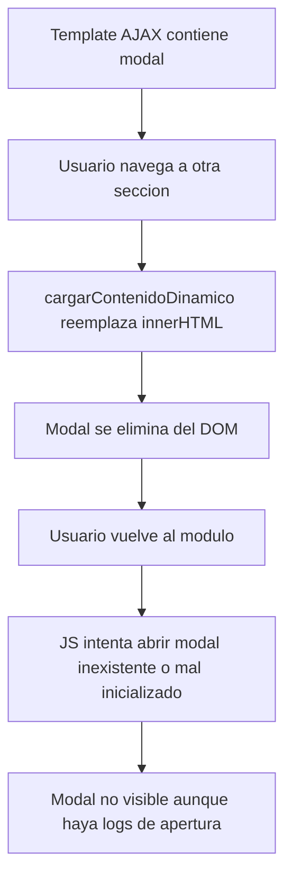

# WF_008 - Modales en Modulos con Carga AJAX

> **Estado:** Documento homologado
> **Origen:** Consolida `DOCUMENTACION_PROBLEMA_MODALES.md`, `SOLUCION_MODALES.md`, `RESUMEN_SOLUCION_MODALES.md` y secciones de `GUIA_DESARROLLO_MODULOS_MES.md`
> **Uso:** Patron obligatorio para modales dentro de modulos AJAX.

---

## Resumen

Los modales definidos dentro de templates AJAX pueden desaparecer o quedar invisibles al navegar entre secciones porque el contenido del contenedor se reemplaza con `innerHTML`. Ademas, estilos globales o CSS de otros modulos pueden dejar el modal con `display: none`, `opacity: 0` o `visibility: hidden`.

La solucion homologada es crear los modales dinamicamente desde JavaScript, insertarlos directamente en `document.body`, aplicar estilos/clases controladas y verificar su existencia antes de abrirlos.

## Problema

Sintomas observados:

1. El modal funciona en la primera carga.
2. Despues de navegar a otra seccion y volver, el modal ya no aparece.
3. Los logs indican que el modal se abre, pero visualmente no se muestra.
4. El fondo o layout del modal cambia por conflictos CSS.
5. Algunos modales quedan dentro de contenedores eliminados por AJAX.

## Causa Raiz



Tambien puede ocurrir que el nodo exista pero CSS externo gane prioridad y deje:

```javascript
{
  display: "none",
  opacity: "0",
  visibility: "hidden"
}
```

## Regla Obligatoria

No colocar modales persistentes dentro del template AJAX si el modal debe sobrevivir navegaciones, tabs o recargas parciales.

Crear o asegurar modales con JavaScript:

1. Buscar el modal por ID.
2. Si no existe, crearlo en `document.body`.
3. Al abrir, forzar el estado visible.
4. Al cerrar, ocultarlo sin eliminarlo, salvo que el modulo requiera limpieza explicita.

## Patron Base

```javascript
function ensureBomModal() {
  let modal = document.getElementById("bom-modal");
  if (modal) return modal;

  modal = document.createElement("div");
  modal.id = "bom-modal";
  modal.className = "bom-modal";
  modal.innerHTML = `
    <div class="bom-modal__dialog" role="dialog" aria-modal="true">
      <header class="bom-modal__header">
        <h2>Detalle BOM</h2>
        <button type="button" data-bom-close aria-label="Cerrar">x</button>
      </header>
      <div class="bom-modal__body"></div>
    </div>
  `;

  modal.addEventListener("click", (event) => {
    if (event.target === modal || event.target.closest("[data-bom-close]")) {
      closeBomModal();
    }
  });

  document.body.appendChild(modal);
  return modal;
}

function openBomModal() {
  const modal = ensureBomModal();
  modal.style.display = "flex";
  modal.style.opacity = "1";
  modal.style.visibility = "visible";
}

function closeBomModal() {
  const modal = document.getElementById("bom-modal");
  if (!modal) return;
  modal.style.display = "none";
  modal.style.opacity = "0";
  modal.style.visibility = "hidden";
}
```

## CSS Recomendado

Preferir CSS por clase, cargado de forma persistente segun `WF_004`:

```css
.bom-modal {
  position: fixed;
  inset: 0;
  display: none;
  align-items: center;
  justify-content: center;
  z-index: 10000;
  background: rgba(0, 0, 0, 0.55);
}

.bom-modal__dialog {
  width: min(920px, calc(100vw - 32px));
  max-height: calc(100vh - 32px);
  overflow: auto;
  background: #ffffff;
  border: 1px solid #d0d7de;
}
```

Si existe conflicto CSS dificil de aislar, se permite `style.cssText` como defensa puntual, pero no debe ser la primera opcion para nuevos modulos.

## Checklist de Implementacion

- El modal se crea en `document.body`.
- El ID del modal es unico por modulo.
- La funcion `ensure*Modal()` es idempotente.
- El cierre funciona por boton, overlay y tecla Escape si aplica.
- El modal no depende de `DOMContentLoaded`.
- El modal se abre correctamente despues de navegar a otra seccion y volver.
- El modal se abre correctamente despues de restaurar tabs tras F5.
- No hay listeners duplicados en cada apertura.

## Migracion de Modales Legacy

1. Identificar modales definidos dentro de templates AJAX.
2. Mover el HTML del modal a una funcion `ensure*Modal()`.
3. Eliminar el modal estatico del template.
4. Reemplazar llamadas directas a `document.getElementById(...).style.display` por `open*Modal()`.
5. Agregar verificacion despues de navegacion AJAX.
6. Probar navegacion entre secciones, restauracion de tabs y recarga.

## Casos Cubiertos por la Documentacion Legacy

El problema original se observo en modales de Control de Produccion ASSY:

- Nuevo Plan.
- Editar Plan.
- Reprogramar.
- Importar Work Orders.

La causa comun fue la combinacion de modales dentro de contenedores reemplazados por AJAX y estilos que dejaban el modal invisible.

## Documentos Legacy Cubiertos

- `DOCUMENTACION_PROBLEMA_MODALES.md`
- `SOLUCION_MODALES.md`
- `RESUMEN_SOLUCION_MODALES.md`
- Secciones de modales dentro de `GUIA_DESARROLLO_MODULOS_MES.md`
