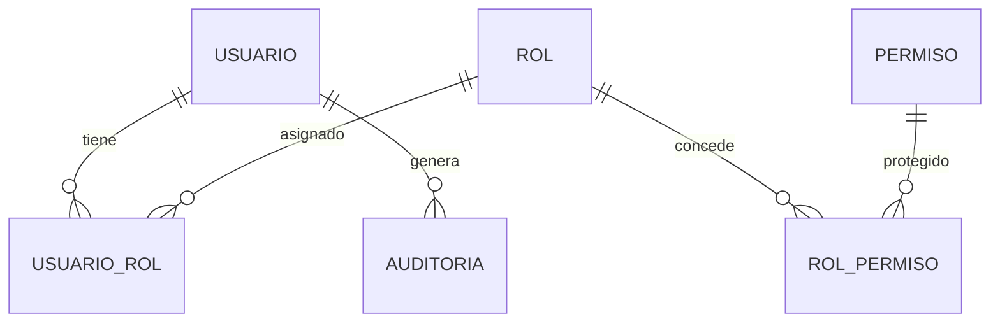
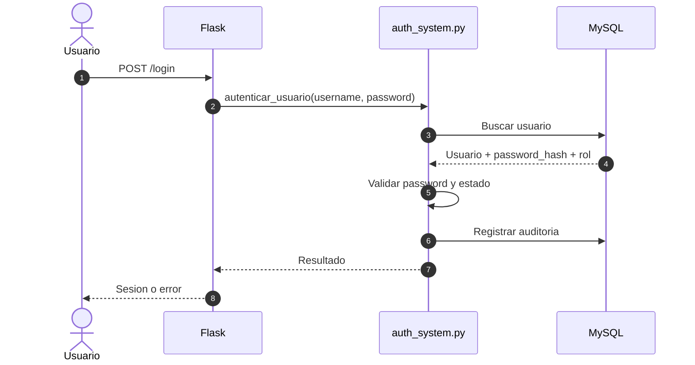

# WF_009 - Autenticacion, RBAC, Permisos y Auditoria

> **Estado:** Documento homologado
> **Origen:** Consolida `SISTEMA_AUTENTICACION_ROLES.md` y complementa `WF_005`
> **Uso:** Referencia para login, roles, permisos, dropdowns y auditoria.

---

## Resumen

El MES usa un sistema RBAC basado en usuarios, roles y permisos granulares de botones/dropdowns. La visibilidad de opciones en la UI y la autorizacion de acciones del backend deben validarse de forma coordinada.

`WF_005` cubre un caso especifico de permisos de dropdown con caracteres especiales. Este documento cubre el sistema general.

## Componentes

| Archivo | Responsabilidad |
|---|---|
| `app/auth_system.py` | Login, usuarios, roles, permisos, auditoria y helpers RBAC. |
| `app/user_admin.py` | Administracion de usuarios, roles y sincronizacion de permisos. |
| `app/api/shared/__init__.py` | Reexports de decoradores y helpers de permisos. |
| `app/static/js/permisos-dropdowns.js` | Ocultado/validacion de permisos en frontend. |
| `LISTA_*.html` | Fuente declarativa de permisos visibles por modulo/vista. |

## Modelo Conceptual



## Flujo de Autenticacion



## Flujo de Autorizacion

1. El usuario inicia sesion.
2. El backend carga contexto de usuario y rol.
3. El frontend carga LISTAS y botones con atributos `data-permiso-*`.
4. `permisos-dropdowns.js` oculta elementos no autorizados.
5. El backend vuelve a validar permisos en rutas sensibles.

Regla: ocultar en frontend mejora UX, pero no sustituye validacion backend.

## Patron de Permiso en HTML

```html
<li
  data-permiso-modulo="Control de proceso"
  data-permiso-vista="Control BOM"
  onclick="mostrarControlBOM()"
>
  Control BOM
</li>
```

## Patron de Decorador en Backend

```python
from app.api.shared import login_requerido


@bp.route("/control-bom")
@login_requerido
def control_bom_view():
    ...
```

Si la ruta ejecuta acciones criticas, agregar verificacion explicita de permiso de accion segun el patron local vigente.

## Sincronizacion de Permisos

Cuando se agrega un boton o dropdown:

1. Agregar atributos `data-permiso-*` al HTML.
2. Ejecutar/sincronizar permisos desde el administrador.
3. Asignar permisos al rol.
4. Probar con usuario con permiso y sin permiso.
5. Revisar que el backend no permita acceso directo si aplica.

## Dropdowns y Caracteres Especiales

Para dropdowns, acentos, espacios, slash, parentesis y otros caracteres pueden romper comparaciones si se inyectan sin normalizacion o escape correcto.

Regla: seguir `WF_005` para dropdowns con caracteres especiales. Evitar construir JS inline dinamico con strings de permisos sin escape.

## Auditoria

Las acciones relevantes deben registrarse con:

- Usuario.
- Accion.
- Modulo.
- Fecha/hora.
- Resultado.
- Detalle util para diagnostico.

No registrar passwords, tokens, secretos ni informacion sensible innecesaria.

## Riesgos Conocidos

| Riesgo | Mitigacion |
|---|---|
| Permiso oculto solo en frontend | Validar tambien en backend. |
| Nombre de permiso con caracteres especiales | Usar patron de `WF_005`. |
| Ruta nueva sin decorador | Checklist obligatorio en PR/cambio. |
| Permiso creado pero no asignado | Probar con rol real. |
| Credenciales o secretos inseguros | Ver `WF_011` para remediacion priorizada. |

## Checklist de Nuevo Modulo con Permisos

- El item de sidebar tiene `data-permiso-*`.
- El permiso aparece en la administracion.
- El rol correcto tiene el permiso asignado.
- La ruta esta protegida con login.
- Acciones criticas validan autorizacion.
- La UI se comporta bien con usuario sin permiso.
- No hay strings de permisos sin escape en JS inline.

## Documentos Legacy Cubiertos

- `SISTEMA_AUTENTICACION_ROLES.md`
- Complementa `WF_005_Permisos_Dropdowns_Caracteres_Especiales.md`
