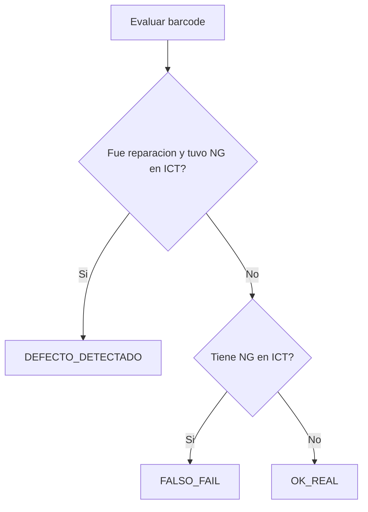
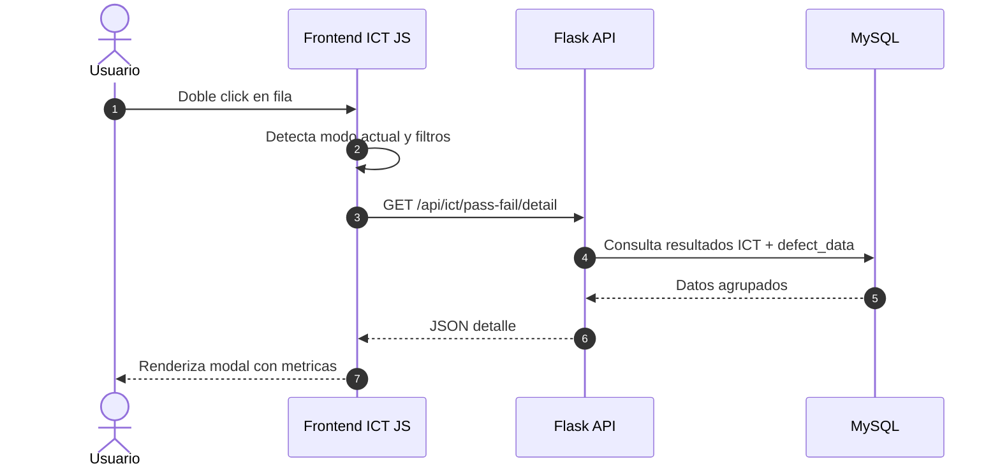

# WF_012 - ICT Pass/Fail: Modo Detallado

> **Estado:** Documento homologado
> **Origen:** Consolida `documentacion_ict_detallado.md`
> **Uso:** Referencia funcional y tecnica del modo detallado de ICT Pass/Fail.

---

## Resumen

El historial de ICT Pass/Fail tiene dos modos:

| Modo      | Enfoque                                                               |
|-----------|-----------------------------------------------------------------------|
| Normal    | Estadisticas por intentos de prueba independientes.                   |
| Detallado | Estadisticas por piezas unicas y comparacion con reparaciones reales. |

El modo detallado mide la precision del ICT comparando resultados `OK/NG` por barcode contra reparaciones registradas en `defect_data`.

## Regla de Negocio Principal

Una reparacion solo cuenta como defecto detectado cuando:

```text
fue_reparacion = true AND ng_count > 0
```

Si una pieza fue reparada pero el ICT la marco OK en todos sus intentos (`ng_count = 0`), la reparacion se ignora para el calculo ICT y la pieza se trata como `OK_REAL`.

Motivo: no todas las reparaciones corresponden a defectos que el ICT evalua. Contarlas como fugas penalizaria injustamente al equipo.

## Clasificacion



## Tabla de Clases

| Clase               | Condicion                               | Interpretacion                                   |
|---------------------|-----------------------------------------|--------------------------------------------------|
| `DEFECTO_DETECTADO` | Reparada y `ng_count > 0`               | ICT detecto una pieza realmente defectuosa.      |
| `FALSO_FAIL`        | `ng_count > 0` sin reparacion aplicable | ICT marco falla en pieza sin defecto confirmado. |
| `OK_REAL`           | `ng_count = 0`                          | Pieza correcta para fines del ICT.               |

La clase `FALSO_NEGATIVO` fue eliminada como clasificacion activa. Los campos relacionados pueden conservarse en API/Excel por compatibilidad, pero deben valer `0`.

## Metricas

| Metrica                  | Formula conceptual                                |
|--------------------------|---------------------------------------------------|
| Precision / `% Correcto` | `correcto_real / total_real * 100`                |
| Deteccion                | `defectos_detectados / piezas_con_defecto * 100`  |
| Falso Negativo           | Conservado por compatibilidad, valor esperado `0` |
| Falso Fail               | `falsos_fail / intentos_sin_defecto * 100`        |

## Flujo de Modal Detallado



## Exportacion Excel

La exportacion debe respetar el modo activo:

- Modo normal: datos por intentos.
- Modo detallado: datos clasificados por pieza/barcode y metricas reales.

El campo de falso negativo puede omitirse visualmente o mantenerse en `0` si es necesario por compatibilidad de columnas.

## Validaciones

- Una pieza reparada sin NG en ICT no debe generar falso negativo.
- Una pieza con NG y reparacion debe contar como defecto detectado.
- Una pieza con NG sin reparacion aplicable debe contar como falso fail.
- Los porcentajes no deben dividir entre cero.
- Modal y Excel deben usar la misma clasificacion.

## Documento Legacy Cubierto

- `documentacion_ict_detallado.md`
