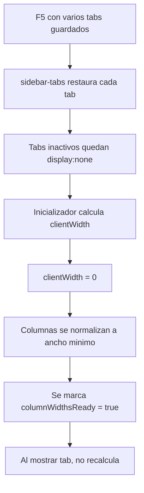

# WF_013 - Bug de Tabs Restaurados y Ancho de Tablas

> **Estado:** Documento homologado
> **Origen:** Consolida `BUG_TABS_RESTAURADOS_ANCHO_TABLAS.md`
> **Uso:** Caso especifico de diagnostico y patron preventivo para tablas que calculan ancho mientras estan ocultas.

---

## Resumen

Al restaurar tabs despues de F5, algunas tablas de Almacen de Embarques aparecian desplazadas o comprimidas. La causa fue que los modulos calcularon anchos de columnas mientras sus contenedores estaban ocultos (`display: none`), por lo que `clientWidth` era `0`.

## Modulos Afectados

- Almacen de embarques - entradas.
- Almacen de embarques - salidas.
- Almacen de embarques - retorno.
- Almacen de embarques - movimientos.
- Almacen de embarques - catalogo.
- Inventario general.

## Sintoma

1. Usuario abre varios tabs de embarques.
2. Recarga la pagina con F5.
3. El tab activo se restaura bien.
4. Los tabs inactivos, al abrirse, muestran tablas con columnas mal calculadas.
5. El problema se corrige al hacer resize, abrir DevTools o consultar datos otra vez.

## Causa Raiz



## Solucion Aplicada

### ResizeObserver por Modulo

Detectar la transicion de ancho `0 -> ancho real`, invalidar cache de columnas y recalcular.

```javascript
if (typeof ResizeObserver === "function" && !moduleRoot.__aeResizeObserver) {
  let lastWidth = Math.floor(moduleRoot.getBoundingClientRect().width || 0);

  const ro = new ResizeObserver((entries) => {
    for (const entry of entries) {
      const width = Math.floor(entry.contentRect?.width || 0);
      if (width <= 0) continue;
      if (Math.abs(width - lastWidth) < 1) continue;

      const transicionDesdeOculto = lastWidth === 0;
      lastWidth = width;

      if (transicionDesdeOculto) {
        moduleRoot.querySelectorAll(".ae-table-shell").forEach((shell) => {
          delete shell.dataset.columnWidthsReady;
        });
      }

      updateHeight();
    }
  });

  ro.observe(moduleRoot);
  moduleRoot.__aeResizeObserver = ro;
}
```

### Red de Seguridad en Cambio de Tab

Al cambiar de tab, disparar un `resize` diferido para que modulos dependientes de medidas recalculen.

```javascript
requestAnimationFrame(() => {
  try {
    window.dispatchEvent(new Event("resize"));
  } catch (error) {}
});
```

## Regla para Nuevos Modulos

No calcular ni persistir dimensiones finales cuando el contenedor esta oculto.

Antes de medir:

```javascript
const width = element.getBoundingClientRect().width;
if (width <= 0) {
  return; // esperar a que el tab/contenedor este visible
}
```

Si el modulo depende de dimensiones:

- Usar `ResizeObserver`.
- Invalidar caches cuando el contenedor pase de oculto a visible.
- Recalcular despues de cambios de tab.
- No marcar flags tipo `ready` si la medicion fue `0`.

## Verificacion

1. Abrir varios tabs de embarques.
2. Recargar con F5.
3. Abrir cada tab restaurado.
4. Confirmar que las tablas ocupan el ancho disponible.
5. Confirmar que no hay scroll horizontal innecesario.
6. Confirmar que cabeceras y celdas alinean.

## Leccion General

Todo modulo con tablas, canvases, graficas o layouts medidos por JS debe considerar que puede inicializarse mientras esta oculto por restauracion de tabs o navegacion AJAX.

## Documento Legacy Cubierto

- `BUG_TABS_RESTAURADOS_ANCHO_TABLAS.md`
