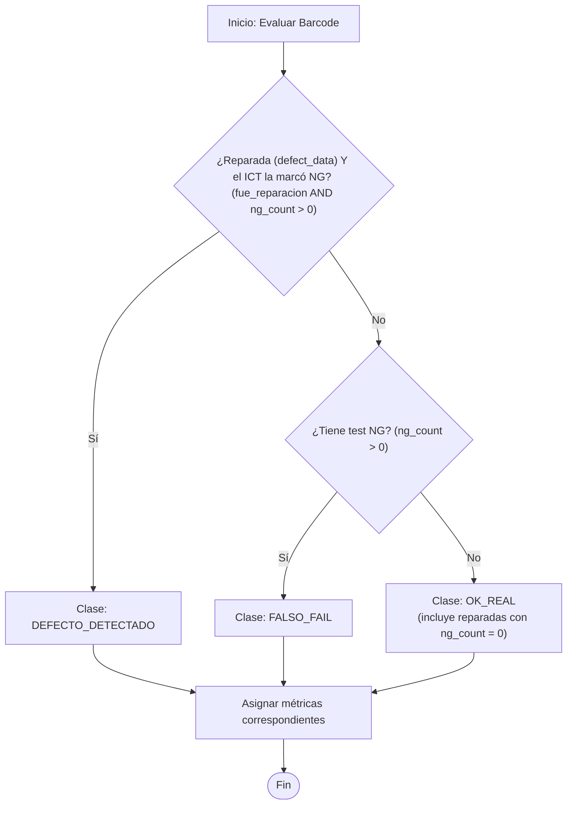
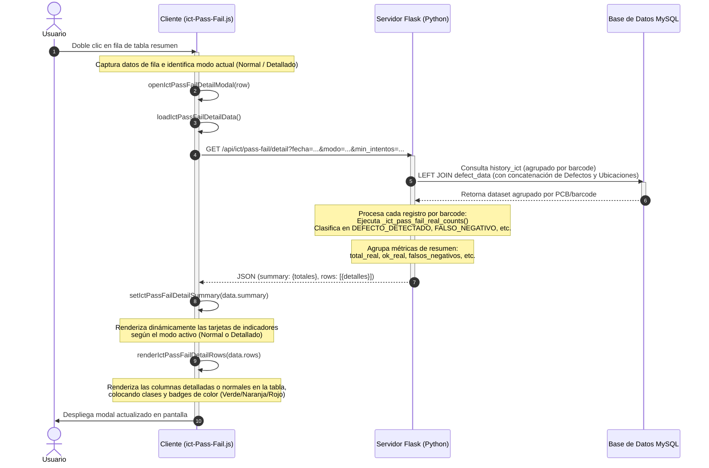

# Documentación: Nuevo Modo Detallado en ICT Pass/Fail

Esta documentación detalla el funcionamiento, la arquitectura y las reglas de negocio implementadas en el **Modo Detallado** de la pantalla de **Historial de ICT Pass/Fail**.

---

## 1. Introducción al Modo Detallado

El **Historial de ICT Pass/Fail** cuenta ahora con dos modos de visualización seleccionables en la interfaz mediante botones de alternancia (toggle):

1. **Modo Normal**: Muestra estadísticas tradicionales basadas en **intentos de prueba independientes** (Total de pruebas, OKs, NGs, y porcentajes de Pass/Fail directos).
2. **Modo Detallado**: Muestra estadísticas inteligentes basadas en **piezas únicas (PCBs)** y su correspondencia con la base de datos de reparaciones (`defect_data`). Este modo clasifica la eficiencia y la precisión del equipo de pruebas (ICT) frente a la realidad de la línea.

---

## 2. Clasificación de Resultados Reales (Reglas de Negocio)

Para cada código de barra único (`barcode`), el sistema realiza un análisis comparando su comportamiento en el ICT (`ok_count`, `ng_count`) y si existe un reporte de reparación registrado en `defect_data` (`fue_reparacion`). La clasificación se rige bajo la siguiente matriz de decisiones:

> **Regla importante (2026-05-28):** Una reparación **solo** cuenta cuando el ICT también marcó la pieza como NG (`ng_count > 0`). Si la pieza fue reparada pero el ICT estuvo **OK en todos sus intentos** (`ng_count = 0`), se **ignora la reparación** y la pieza se trata como `OK_REAL`. El ICT no detecta el 100% de las causas y muchas piezas se reparan por defectos que el ICT no evalúa; contar esas reparaciones como fugas penalizaría injustamente al equipo. Por esta razón ya **no existe la clase `FALSO_NEGATIVO`**.



### Tabla de Métricas por Clasificación

| Criterio / Clase (`criterio_real`) | Descripción | Total Real (`total_real`) | OK Real (`ok_real`) | Detectados (`defectos_detectados`) | Falso Negativo (`falsos_negativos`) | Falso Fail (`falsos_fail`) | Correcto Real (`correcto_real`) | Falla Real (`falla_real`) |
| :--- | :--- | :---: | :---: | :---: | :---: | :---: | :---: | :---: |
| **`DEFECTO_DETECTADO`** | El ICT reportó falla (`NG > 0`) y la pieza fue reparada realmente. | 1 | 0 | 1 | 0 | 0 | 1 | 0 |
| **`FALSO_FAIL`** | El ICT reportó falla (`NG > 0`) pero no es una reparación detectada por el ICT (ej: falso contacto, o reparación sin NG en ICT). | `intentos` | `ok_count` | 0 | 0 | `ng_count` | `ok_count` | `ng_count` |
| **`OK_REAL`** | El ICT aprobó la pieza (`NG = 0`). Incluye las piezas reparadas en las que el ICT estuvo OK en todos los intentos (la reparación se ignora). | `intentos` | `ok_count` | 0 | 0 | 0 | `ok_count` | 0 |

> **Nota sobre `FALSO_NEGATIVO`:** la clase fue eliminada. El campo `falsos_negativos` y `porcentaje_falso_negativo` se conservan en la API/Excel por compatibilidad, pero siempre valen `0`.

---

## 3. Fórmulas de Calidad e Indicadores Clave

Utilizando las métricas anteriores, el sistema calcula los siguientes porcentajes tanto para el resumen principal como para los indicadores del modal detallado:

* **% Correcto (`porcentaje_ok` / Precisión del Test):**  
  Mide qué tan preciso es el ICT respecto a la realidad.
  $$\% \text{ Correcto} = \left( \frac{\text{correcto\_real}}{\text{total\_real}} \right) \times 100$$

* **% Detección (`porcentaje_deteccion` / Sensibilidad):**  
  Mide el porcentaje de defectos reales que el ICT fue capaz de capturar.
  $$\% \text{ Detección} = \left( \frac{\text{defectos\_detectados}}{\text{piezas\_con\_defecto}} \right) \times 100$$

* **% Falso Negativo (`porcentaje_falso_negativo` / Fugas):**  
  Porcentaje de piezas defectuosas que pasaron por el ICT sin ser detectadas.
  $$\% \text{ Falso Negativo} = \left( \frac{\text{falsos\_negativos}}{\text{piezas\_con\_defecto}} \right) \times 100$$
  > Tras la regla del 2026-05-28 `falsos_negativos` siempre vale `0`, por lo que este indicador es constante en `0%`. Se conserva por compatibilidad y se omite de la exportación a Excel.

* **% Falso Fail (`porcentaje_falso_fail` / Falsas Alarmas):**  
  Tasa de falsas alarmas del ICT (pruebas NG en piezas sanas) sobre el total de intentos en piezas sin defecto.
  $$\% \text{ Falso Fail} = \left( \frac{\text{falsos\_fail}}{\text{intentos\_sin\_defecto}} \right) \times 100$$

---

## 4. Flujo de Datos al Dar Doble Clic (Modal)

Cuando el usuario da doble clic en una fila del resumen de ICT Pass/Fail, se ejecuta el siguiente flujo para obtener y desplegar la información en pantalla:



---

## 5. Implementación en Código

### A. Backend - Función de Clasificación (Python)
Ubicada en [historial_ict_pass_fail.py](file:///C:/Users/yahir/OneDrive/Escritorio/MES/MES/MESILSANLOCAL/app/api/control_resultados/historial_ict_pass_fail.py#L58-L93):

```python
def _ict_pass_fail_real_counts(intentos, ok_count, ng_count, fue_reparacion):
    """Clasificar el resultado ICT real de una PCB/barcode.

    Nota: si la pieza fue reparada pero el ICT nunca la marco NG
    (ng_count == 0), se ignora la reparacion y se trata como OK_REAL.
    El ICT no detecta el 100% de las causas y a veces se repara por
    algo que el ICT no evalua, asi que ese caso no se cuenta como
    falso negativo del ICT.
    """
    if fue_reparacion and ng_count > 0:
        return {
            "total_real": 1,
            "ok_real": 0,
            "defectos_detectados": 1,
            "falsos_negativos": 0,
            "falsos_fail": 0,
            "correcto_real": 1,
            "falla_real": 0,
            "criterio_real": "DEFECTO_DETECTADO",
        }

    falsos_fail = ng_count
    return {
        "total_real": intentos,
        "ok_real": ok_count,
        "defectos_detectados": 0,
        "falsos_negativos": 0,
        "falsos_fail": falsos_fail,
        "correcto_real": ok_count,
        "falla_real": falsos_fail,
        "criterio_real": "FALSO_FAIL" if falsos_fail else "OK_REAL",
    }
```

### B. Frontend - Renderizado Dinámico de Indicadores (Javascript)
En [ict-Pass-Fail.js](file:///C:/Users/yahir/OneDrive/Escritorio/MES/MES/MESILSANLOCAL/app/static/js/ict-Pass-Fail.js#L519-L590), la función `setIctPassFailDetailSummary` inyecta las métricas adecuadas en función del modo seleccionado en el sessionStorage:

```javascript
function setIctPassFailDetailSummary(summary = {}) {
  const container = document.querySelector(".ict-pass-fail-detail-summary");
  if (!container) return;

  const mode = getIctPassFailMode();
  const totalIntentos = Number(summary.total_intentos || 0);
  const okTotal = Number(summary.ok_total || 0);
  const ngTotal = Number(summary.ng_total || 0);
  const passRate = totalIntentos > 0 ? (okTotal / totalIntentos) * 100 : 0;
  const failRate = totalIntentos > 0 ? (ngTotal / totalIntentos) * 100 : 0;
  const correctoReal = Number(summary.correcto_real ?? summary.pass_real ?? 0);
  const totalReal = Number(summary.total_real || 0);
  const realRate = summary.porcentaje_pass_real ?? (
    totalReal > 0 ? (correctoReal / totalReal) * 100 : 0
  );

  const cards = mode === "detallado" ? [
    ["Total real", formatIctPassFailNumber(totalReal)],
    ["Correctos", formatIctPassFailNumber(correctoReal), "good"],
    ["OK real", formatIctPassFailNumber(summary.ok_real), "good"],
    ["Detectados", formatIctPassFailNumber(summary.defectos_detectados), "good"],
    ["F. negativos", formatIctPassFailNumber(summary.falsos_negativos), "bad"],
    ["F. fail", formatIctPassFailNumber(summary.falsos_fail), "bad"],
    ["% Correcto", formatIctPassFailPercent(realRate), realRate >= 90 ? "good" : ""],
    ["% Deteccion", formatIctPassFailPercent(summary.porcentaje_deteccion), Number(summary.porcentaje_deteccion || 0) >= 90 ? "good" : ""],
    ["% F. negativo", formatIctPassFailPercent(summary.porcentaje_falso_negativo), Number(summary.porcentaje_falso_negativo || 0) > 0 ? "bad" : ""],
    ["% F. fail", formatIctPassFailPercent(summary.porcentaje_falso_fail), Number(summary.porcentaje_falso_fail || 0) > 10 ? "bad" : ""],
  ] : [
    ["Intentos", formatIctPassFailNumber(totalIntentos)],
    ["OK total", formatIctPassFailNumber(okTotal), "good"],
    ["NG total", formatIctPassFailNumber(ngTotal), "bad"],
    ["Piezas unicas", formatIctPassFailNumber(summary.piezas_unicas)],
    ["Repetidas", formatIctPassFailNumber(summary.piezas_repetidas)],
    ["Reparacion", formatIctPassFailNumber(summary.piezas_reparacion)],
    ["% Pass", formatIctPassFailPercent(passRate), passRate >= 90 ? "good" : ""],
    ["% Fail", formatIctPassFailPercent(failRate), failRate > 10 ? "bad" : ""],
  ];

  container.innerHTML = cards
    .map(([label, value, status]) => {
      const statusClass = status === "good" ? " ict-pass-fail-detail-stat-good" : (status === "bad" ? " ict-pass-fail-detail-stat-bad" : "");
      return `
        <div class="ict-pass-fail-detail-stat${statusClass}">
          <span>${escapeIctPassFailHtml(label)}</span>
          <strong>${escapeIctPassFailHtml(value)}</strong>
        </div>
      `;
    })
    .join("");
}
```

---

## 6. Exportación a Excel por Modo

El botón **"Exportar Excel"** del resumen genera un archivo distinto según el **modo activo** en pantalla. El cliente envía el modo en la query (`/api/ict/pass-fail/export?...&modo=normal|detallado`) y el backend arma las columnas correspondientes.

| Modo | Columnas | Fuente de los % | Barra `PORCENTAJE` |
| :--- | :--- | :--- | :--- |
| **Normal** | Fecha, Línea, ICT, Turno, Número de parte, **Intentos, OK, NG, % Pass, % Fail** | Intentos crudos (`total_intentos`, `ok_count_raw`, `ng_count_raw`) — idéntico a la pantalla | `% Pass` / `% Fail` |
| **Detallado** | Fecha, Línea, ICT, Turno, Número de parte, **Total real, Correctos, OK real, Detectados, F. fail, % Correcto, % Detección, % F. fail** | Métricas reales reclasificadas (aplica la regla de ignorar reparación con `ng_count = 0`) | `% Correcto` / `(100 − % Correcto)` |

Notas:

* El modo **Detallado** ya **no incluye** las columnas `F. negativos` ni `% F. negativo` (siempre serían `0` por la regla del 2026-05-28).
* El nombre del archivo incluye el modo: `historial_ict_pass_fail_<modo>_AAAAMMDD_HHMMSS.xlsx`.
* La barra de porcentaje se inserta dinámicamente en la última columna de cada modo (`image_cell.column_letter`), por lo que el ancho y la posición se ajustan automáticamente al número de columnas.
